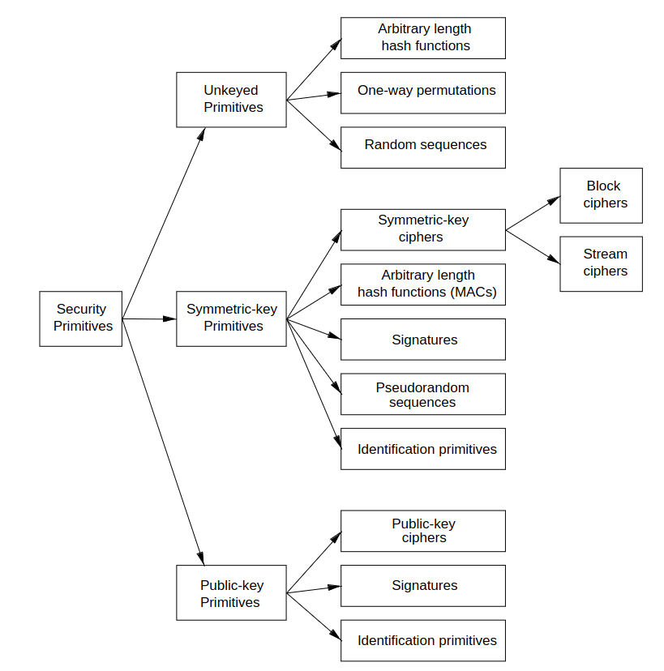
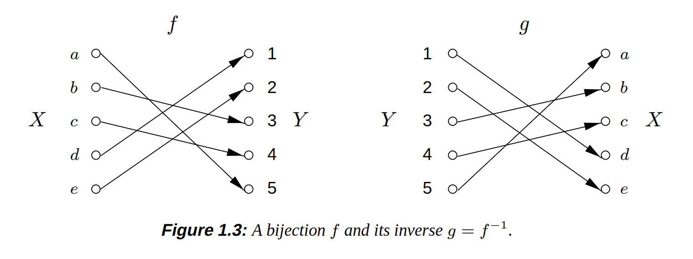
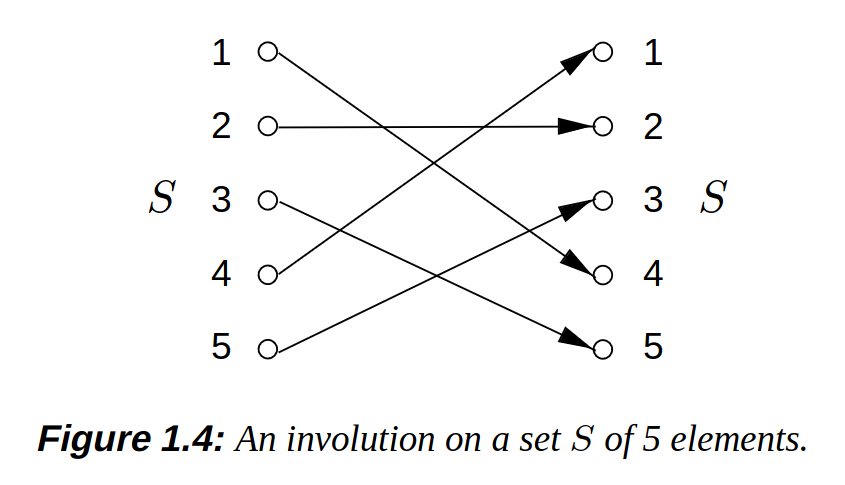
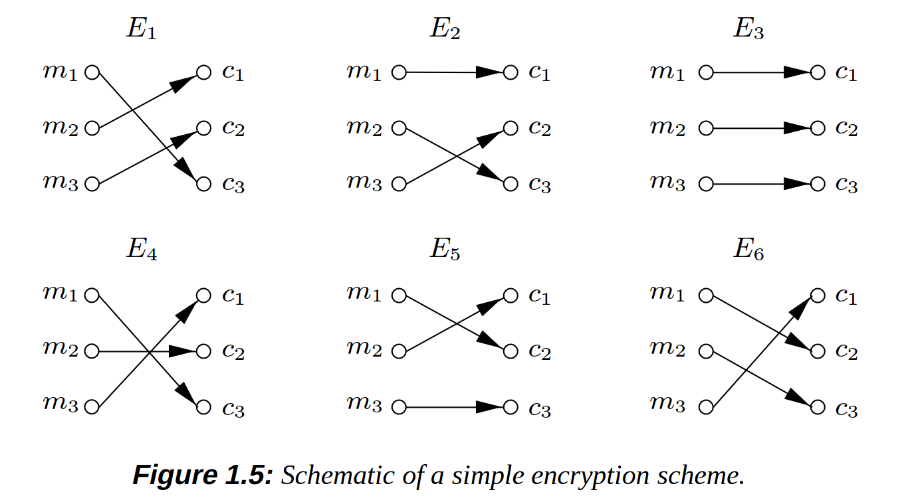
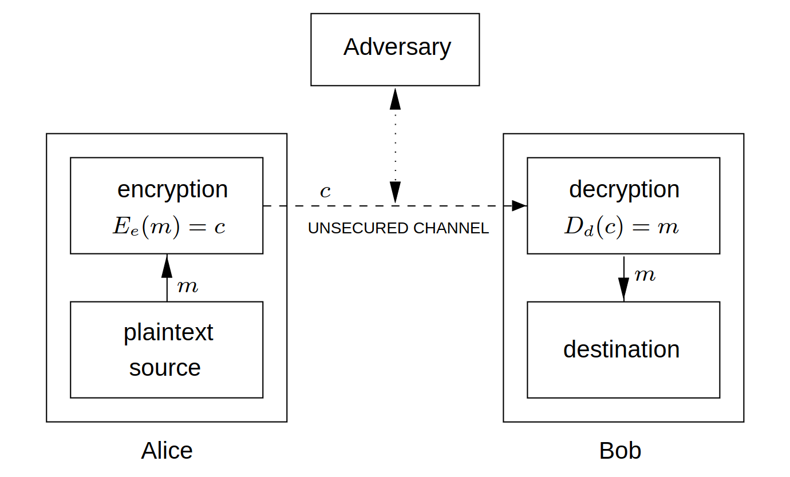
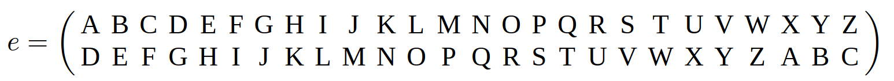
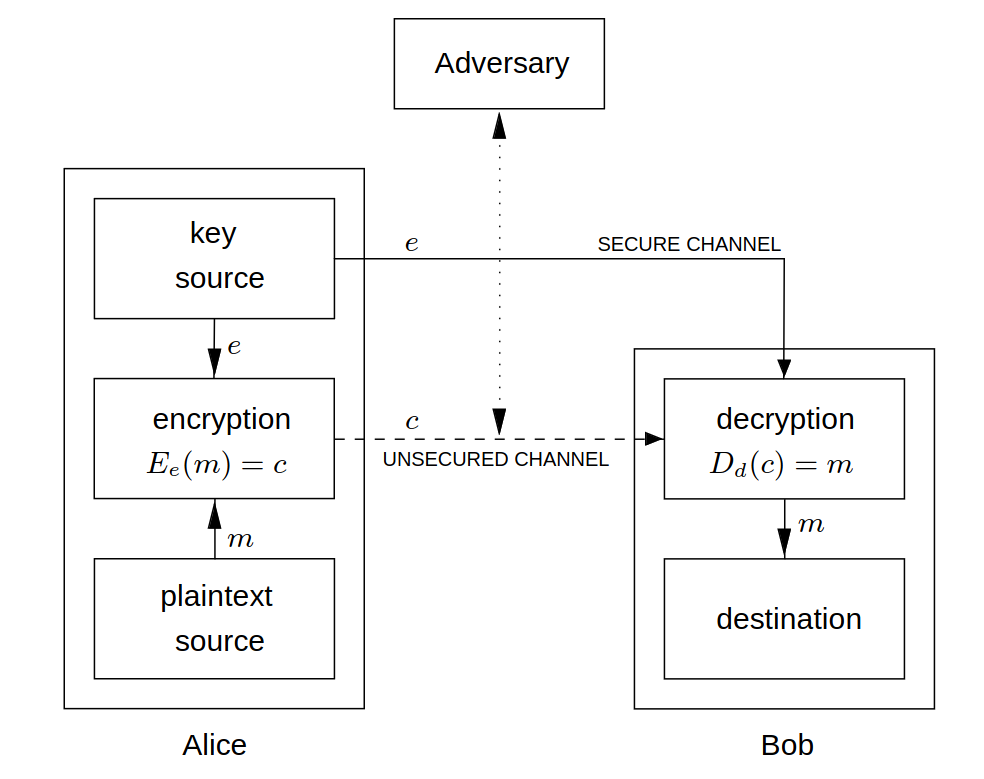
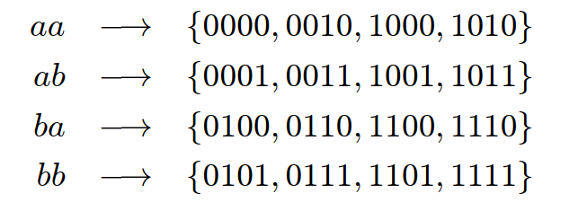

# CHAPTER 1
- Cryptography was used as a tool to protect national secrets and strategies
- DES (Data Encryption Standard) is the most well-known cryptographic mechanism of history
- Des is the standard for securing eletronic commerce for many financial institutions around the world
- RSA comes from a hard mathematical problem, which is the intractability of factoring large integers
- First standard for digital signatures (ISO/IEC 9796), based on RSA public-key scheme
- The objectives of information security cannot be achieved only by mathematical algorithms and protocols alone, but require procedural techniques and abidance of laws

|key|meaning|
|--|--|
|privacy and confidentiality| Keeping information secret to everyone that is not authorized to see it|
|data integrity|ensuring that information has not been altered by unauthorized or unknowns means|
|entity authentication or identification| Confirming the identity of someone|
|message authentication|confirm the source of the information, know the origin of the authentication|
|signature|mechanism that got created to bind information to a identity|
|authorization|Make another identity enable your identity to perform something or be something|
|validation|Mean to have the opportunity to use or manipulate information or resources|
|access control|restricting access to resources to privileged entities|
|certification|endorsement(transfer the power/right to peform such activity) of information by a trusted entity|
|timestamping|recording the time of creation or existence of information|
|witnessing|veryfying of something acomplished by other than the creator|
|receipt|acknowledgement that information has been received|
|confirmation|acknowledgement that services have been provided|
|ownership|mechanism to provide an entity the legal right to use or transfer a resource to others|
|anonymity| conceling/hiding the identity of an entity involved in some process|
|non-repudiation|preventing the denial of previous commitments or actions|
|revocation|retraction of certification or authorization|
- one of the fundamental tools used in information security is the signature
- signature is a building block for many other services such as non-repudian, data origin authentication, identification and witnessing
- **definition ->** *cryptography*, is the study of mathematical techniques related to aspects of information security such as confidentiality,data integrity,entity authentication and data origin authentication.
## Cryptographic goals
### 1. Confidentiality
- Service used to keep the content of information from all but those authorized to have it
- Approaches to achieve it are like for example physical protection or mathematical algorithms
### 2. Data Integrity
- Service which addresses the unauthorized alteration of data
- To ensure it we must have the ability to detect data manipulation
- Data manipulation includes insertion,deletion and substitution
### 3. Authentication
- Service related to identification
- Applies to entities and information
- Two parties entering into a communication should identify each other
- Information over a channel should be authenticated as from origin
- This concerns entity authentication and data origin authentication
- Data origin authentication provides data integrity (if the message got modified, the source has changed as well)
### 4. Non-Repudiation 
- Service which prevents an entity from denying previous commitments or actions
- This is a concern related to a entity perform some kind of task and then denying it. We should have a mechanism to not enable such thing
- This needs a procedure involving a trusted third party
---
- Cryptography is about the prevention and detection of cheating and other malicious activities
- Examples of tools are: encryption schemes, hash functions and digital signature schemes.
- Example of the primitives
  
## Primitives criteria evaluation
### 1. Level of Security
- Hard to quantify
- It is given with the number of operations required (using the best methods currently known). This is called the work factor and is defined by upper bound on the amount of work necessary to defeat the object
### 2. Functionality
- Primitives need to be combined to achieve security objectives
- Which primatives are most effective is determined by the basic properties
### 3. Methods of operation
- Primitives when applied to various ways and with various inputs, will show different characteristics. This different characteristics also depend on the mode of operation or usage
### 4. Performance
- This refers to the efficiency of a primitive in a particular mode of operation (ex: number of bits per second which it can encrypt)
### 5. ease of implementation
- Difficulty of implementing a primitive in either software or hardware
---
- We need to consider that some systems dont have the enought resources to take specific primitives. So, sometimes we make a tradeoff between the security and the better performance of the system
## 1-1 functions
- A bijection is a function that for every domain of it, it has only one unique codomain
- Inverse of a function is one function that each domain represents the codomain of other funtion and that each codomain represents the domain of the same other function (it is represented by function = otherfunction^-1)

---
## 1 way functions
- It is easy to compute f(x), but it is hard to find x so that f(x)=y (only using a table and if you have one)
- Example
  ```
  A prime number is a positive integer greater than 1 whose only positive integer divisors are 1 and itself
  Primes: 
  p = 48611 
  q = 53993
  n = pq = 2624653723
  X = {1,2,3,..,n-1}
  f(x) = r_(x), x E X
  r_x is the remainder when x³ is divided by n
  f(2489991) = 1981394214 (2489991^3 = 5881949859*n +1981394214(remainder))
  f(x) is easy to do.. but founding the x is hard, but if we know p and q, then it becomes more fast to find the remainder
  ```
---
## Trapdoor one-way functions
- Function that despite beeing very hard to find a x so that f(x)=y, with more information it becomes more easy to find
- Example
  ```
    n = 2624653723
    p = 48611
    q = 53993
    f(x) = r_(x)
    if you know p and q, then it is easy to get the x.. because it ends like (x³ = z*2624653723+y)
  ```
---
- Oneway and trapdoor one way functions are the basis for public-key cryptography
- In this examples we are using small numbers, but if p and q had for example 100 digits, it would be very hard for the standard computers to deduce such numbers
- Permutations is a bijective function
- Involutions are a type of function that represents its own inverse, which means that f = f^-1 or f(f(x))=x

## Basic terminology and concepts on the book
### Encryption domains and codomains
- **A**, denotes a finite set called the alphabet of definition. A={0,1}, the binary alphabet. There are 32 binary strings of length five, each letter of the english alphabete as a unique binary string of length five (ex: A={/,?} and a string "A" can be denoted as "/?/")
- **M** denotes a set called the message space. This is the plaintext message.
- **C** denotes a set called the ciphertext space. C consists of strings of symbols from a alphabet definition, which may defer from the alphabet of definition for M. This is the ciphertext.
---
### Encryption and decryption transformations
- **K**, is the key space. An element of K is called a Key
- Each element of **K** (**e**, which is a key), determines the bijection from **M** to **C**. The bijection determination is represented by **E_e**. **E_e** is a encryption function. This means that for each ciphertext we must have a unique plaintext message
- For each **d** E **K**, **D_d** denotes a bijection from **C** to **M**. **D_d** is called a decryption function
- The process of applying the transformation **E_e** to a message **m** E **M** is the ecryption of **m**
- The process of applying the transformation **D_d** to a ciphertext **c** is the decryption of **c**
- An encrypt scheme consists of a set {**E_e**:**e** E **K**} of encryption transformations and a corresponding set {**D_d**: **d** E **K**} of decryption transformations. **D_d**=**E_e^-1**. **D_d**(**E_e**(**m**))=**m** for all **m** E **M**. An encryption scheme is a cipher (in another words a cipher is a conjunction of encryption operations (encrypt and decrypt))
- The keys **e** and **d** is a key pair and can be the samE
- To construct a encryption scheme, it requires one to select a message space **M**, a cipher space **C**, a key space **K**, a set of encryption transformations {**E_e**:**e** E **K**} and a set of decryption transformations {**D_d**:**d** E **K**}
---
## Achieving confidentiality example
- Alice and Bob firstly choose or secretly exchange a key pair (**e**,**d**)
- Alice wants to send a message **m** E **M** to Bob, she computes **c** = **E_e**(**m**) and sends **c** to Bob
- Bob computes **D_d**(**c**) = **m** and reads the **m**
- Note that this approach is better than simply selecting a encryption and encryption algorithmn, because if they key pair is compromised, you simply need to change the key pair and not the whole algorithmn, which is more efficient
- It is a good practise change this key pair frequently
- Example of encryption scheme
  ```
  M = {m1,m2,m3}
  C = {c1,c2,c3}
  There are 3! = 6 bijections from M to C
  K = {1,2,3,4,5,6} has 6 elements, each specifying one of the transformations
  ```
  
  - The result is as follows
  - Alice computes **E_1**(**m1**) = **c3** and sends **c3** to Bob
  - Bob decrypts **c3** by reversing the arrows on the diagram for **E_1** and observing that **c3** points to **m1**
  
### Communication participants
- An **entity** or party is someone which sends,receives or manipulates information. In the above example Alice and Bob are entities. A entity can be a person,computer,etc..
- A **sender** is an entity in a two party communication (info transmitter)
- A **receiver** is a entity in a two party communication (info receiver)
- The adversary is someone that is not apart of the sender and receiver group that wants to defeat the information security service provided between sender and receiver. This is an enemy,attacker,tapper,intruder,etc..
---
### Channels
- **Channel** is a mean to send info from one entity to another
- **Physically secure channel** is one which is not physically accessible to the enemy
- **unsecured channel** is one from which parties other that the legitimate ones whish and can reorder,delete,insert or read
- **secured channel** is one from which an enemy does not have the ability does not have the ability to reorder,delete,insert or read
- The difference between a secured channel and a Physically secure channel is that the secure can be either secured by physical or cryptographic techniques.
- With physicall secure we mean trusted couriers, personal contact between parties and a dedicated communication link for example
---
### Security
- A fundamental premise in cryptography is that the sets **M**,**C**,**K**,{**E_e**:**e** E **K**},{**D_d**:**d** E **K**} are public knowledge
- The only thing that is secret is the key pair (**e**,**d**) which they are using
- The best is to keep secret the encryption,decreption and the key pair but you cannot rely in only maintaining private the ecryption and decreption.
- An encryption scheme is said to be breakable if a third party, without knowledge of the key pair (**e**,**d**) can systematically recover plaintext from corresponding ciphertext within some appropriate time frame
- An appropriate time frame depends of the usage of the message, you only need to keep the secret within the time that this message needs to be processed
- An encryption scheme can be broken by trying all possible keys to see which one the communicating parties are using, this is called **exhaustive search** of the key space
- The key space must be large enought to make this infeasible
---
### Requirements for cipher systems
1. The system should if not theorically unbreakable, unbreakable in practise.
2. Compromise of the system details should not inconvenience the correspondents
3. The key should be rememberable without notes and easily changed
4. The cryptogram should be transmissible by telegraph
5. The encryption apparatus should be portable and operable by a single person
6. The system should be easy, requiring neither the knowledge of a long list of rules nor mental strain
---
### Information Security in General
- **Information security service** is a method to provide some specific aspect of security. (ex: integrity of transmitted data, the method to ensure this is an information security service)
- Breaking an information security service implies defeating the objectivee of the service
- **Passive adversary** is a enemy only capable of reading information from an unsecured channel
- **Active adversary** is an adversary who may also transmit,alter or delete information on an unsecured channel
---
### Cryptology
- **Cryptanalysis** is the study of mathematical techniques for attemping to defeat cryptographic techniques, and, more generally, information security services.
- **Cryptoanalyst** is someone that engages into **cryptoanalysis**
- **Cryptology** is the study of **cryptography** and **cryptoanalysis**
- **Cryptosystem** is a general term referring to a set of cryptographic primitives used to provide information security devices. Most often the term is used in conjuction with primitives providing confidentiality ex: encryption 
- **Cryptographic techniques** are divided into two generic types: **symmetric-key** and **public-key**
---
## Symmetric-key Encryption
### Block ciphers and Stream Ciphers
- If you have two sets {**E_e**:**e** E **K**} and {**D_d**:**d** E **K**}, **K** is the key space
- The encryption scheme is symmetric-key if for each key pair (**e**,**d**) it is "easy" to determine **d** knowing only **e** and determine **e** knowing **d**.
- Most of the symmetric-key encryption system have **e**=**d**, so this symmetric-key becomes appropriate. 
- It has a single-key, only one private key
- Example
  ```
  A = {A,B,C,D,...,X,Y,Z}
  M = C = String which length = 5 from A
  e is chosen to be a permutation on A (a function that encrypts A)
  e is applied to each letter one at a time
  to decrypt d is applied (d=e^-1)
  supposing that e is the permutation that a letter will become the 3 positions to the right letter we will have something like the image bellow
  ```
  
  - As you can see A become D, B became E and so on
  - So, if **m**=THISC IPHER ISCER TAINL YNOTS ECURE
  - **c** = **E_e**(**m**) = WKLVF LSKHU LVFHU WDLQO BQRWV HFXUH
    
- One of the main isues of the symmetric-key systems is to find a efficient method to agree upon and exchange keys securely
- There are two classes of symetric-key encryption schemes: **block ciphers** and **stream ciphers**
### **Block Cipher**
- Encryption scheme which breaks up the plaintext into multiple strings (called blocks)
- Blocks have a fixed length t over a Alphabet A
- Then it encrypts one block at time
- Most well-known symmetric-key encryption techniques are block ciphers
- Block ciphers have 2 classes: **substitution ciphers** and **transposition ciphers**. **Product ciphers** is a combination of both
#### Substitution Ciphers
- Block ciphers which replace symbols (or groups of symbols) by other symbols or groups of symbols
##### Example
- **A** = alphabet of **q** symbols
- **M** = set of all strings of length **t** over **A**
- **K** = set of all permutations on the set **A**
- **e** is from **K**
- (**m_1** **m_2** ... **m_t**) are from **M**
- **E_e**(**m**) = (**e**(**m_1**) **e**(**m_2**)...(**m_t**)) = (**c_1** **c_2** ... **c_t**) = **c**
- **m** = (**m_1** **m_2**...**m_t**) E **M**
- To decrypt **c** we need to compute the inverse permutation **d**=**e^-1**
- **D_d**(**c**)=(**d**(**c_1**) **d**(**c_2**)...**d**(**c_t**)) = (**m_1** **m_2**...**m_t**) = **m**
- **E_e** is a **simple substitution cipher**
- This example of course is inadequated for security, even if the key space bigger
- If the key space is the English alphabet the key space would be **26!** and the key used can be easily observed by observing a modest amount of ciphertext
#### Homophonic Substitution Ciphers
- To each symbol **a** E **A**
- Associate a set **H**(**a**) of strings of **t** symbols
- The restriction here is that the sets **H**(**a**),**a** E **A**,be pairwise disjoint (This means that for the set **H**(), there isnt a single member that is equal to a member of the set **A**)
- In a homophonic substitution, the cipher replaces each symbol **a** in a plaintext message block with a randomly chosen string from **H**(**a**)
- To decrypt a string **c** of **t** symbols, one must determine **a** E **A** such that **c** E **H**(**a**)
- The key for the cipher consists of the sets **H**(**a**)
##### Example
- **A** = {**a**,**b**}
- **H**(**a**)={00,10}
- **H**(**b**)={01,11}
- the plaintext message block **ab** encrypts to one of the following: 0001,0011,1001,1011
- Since it will randomly choose one element from the sets **H**(**a**) and **H**(**b**), this is the solution space for different plaintexts:
  
- As you can see by this randomness and not apart of sets factor, it becomes more hard to compute ciphering
#### Polyalphabetic substitution ciphers
- is a block cipher with block length **t** over an alphabet **A**
- it has the following properties:
  - the key space **K** consists of all ordered sets of **t** permutations (**p_1**,**p_2**,...,**p_t**) where each permuation **p_i** is defined on the set **A**
  - encryption of the message **m**=(**m_1** **m_2** ... **m_t**) under the key **e** = (**p_1**,**p_2**,...,**p_t**). It is given by **E_e**(**m**) = (**p_1**(**m_1**) **p_2**(**m_2**) ... **p_t**(**m_t**))
  - the decryption key associated with **e** = (**p_1**,**p_2**,...,**p_t**) is **d**=(**(p_1)^-1**,**(p_2)^-1**,...,**(p_t)^-1**)
##### Example
- **A** = {**A**,**B**,**C**,...,**X**,**Y**,**Z**} and **t**=3
- Choose **e** = (**p_1**,**p_2**,**p_3**)
- **p_1** maps each letter to the letter three positions to its right
- **p_2** maps to seven positions to its right
- **p_3** ten positions to its right
- **m** = THI SCI PHE RIS CER TAI NLY NOT SEC URE
- **c** = **E_e**(**m**) = WOS VJS SOO UPC FLB WHS QSI QVD VLM XYO
- The advantage of Polyalphabetic ciphers is that the frequency of symbols is not preserved
- This is not significantly more difficult to cryptanalyze
- the approach is similar to the other.. the difference is that we consider, accordinly to the length of each block that 1 <= **i** <= **t** where the permutation is **p_i** (basicly a frequency analysis is done)
#### Transposition ciphers
