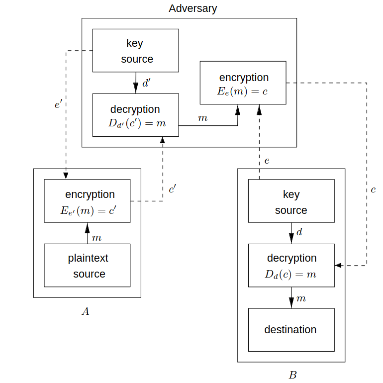

# CHAPTER 1
- Cryptography was used as a tool to protect national secrets and strategies
- DES (Data Encryption Standard) is the most well-known cryptographic mechanism of history
- Des is the standard for securing eletronic commerce for many financial institutions around the world
- RSA comes from a hard mathematical problem, which is the intractability of factoring large integers
- First standard for digital signatures (ISO/IEC 9796), based on RSA public-key scheme
- The objectives of information security cannot be achieved only by mathematical algorithms and protocols alone, but require procedural techniques and abidance of laws

|key|meaning|
|--|--|
|privacy and confidentiality| Keeping information secret to everyone that is not authorized to see it|
|data integrity|ensuring that information has not been altered by unauthorized or unknowns means|
|entity authentication or identification| Confirming the identity of someone|
|message authentication|confirm the source of the information, know the origin of the authentication|
|signature|mechanism that got created to bind information to a identity|
|authorization|Make another identity enable your identity to perform something or be something|
|validation|Mean to have the opportunity to use or manipulate information or resources|
|access control|restricting access to resources to privileged entities|
|certification|endorsement(transfer the power/right to peform such activity) of information by a trusted entity|
|timestamping|recording the time of creation or existence of information|
|witnessing|veryfying of something acomplished by other than the creator|
|receipt|acknowledgement that information has been received|
|confirmation|acknowledgement that services have been provided|
|ownership|mechanism to provide an entity the legal right to use or transfer a resource to others|
|anonymity| conceling/hiding the identity of an entity involved in some process|
|non-repudiation|preventing the denial of previous commitments or actions|
|revocation|retraction of certification or authorization|
- one of the fundamental tools used in information security is the signature
- signature is a building block for many other services such as non-repudian, data origin authentication, identification and witnessing
- **definition ->** *cryptography*, is the study of mathematical techniques related to aspects of information security such as confidentiality,data integrity,entity authentication and data origin authentication.
## Cryptographic goals
### 1. Confidentiality
- Service used to keep the content of information from all but those authorized to have it
- Approaches to achieve it are like for example physical protection or mathematical algorithms
### 2. Data Integrity
- Service which addresses the unauthorized alteration of data
- To ensure it we must have the ability to detect data manipulation
- Data manipulation includes insertion,deletion and substitution
### 3. Authentication
- Service related to identification
- Applies to entities and information
- Two parties entering into a communication should identify each other
- Information over a channel should be authenticated as from origin
- This concerns entity authentication and data origin authentication
- Data origin authentication provides data integrity (if the message got modified, the source has changed as well)
### 4. Non-Repudiation 
- Service which prevents an entity from denying previous commitments or actions
- This is a concern related to a entity perform some kind of task and then denying it. We should have a mechanism to not enable such thing
- This needs a procedure involving a trusted third party
---
- Cryptography is about the prevention and detection of cheating and other malicious activities
- Examples of tools are: encryption schemes, hash functions and digital signature schemes.
- Example of the primitives
  
## Primitives criteria evaluation
### 1. Level of Security
- Hard to quantify
- It is given with the number of operations required (using the best methods currently known). This is called the work factor and is defined by upper bound on the amount of work necessary to defeat the object
### 2. Functionality
- Primitives need to be combined to achieve security objectives
- Which primatives are most effective is determined by the basic properties
### 3. Methods of operation
- Primitives when applied to various ways and with various inputs, will show different characteristics. This different characteristics also depend on the mode of operation or usage
### 4. Performance
- This refers to the efficiency of a primitive in a particular mode of operation (ex: number of bits per second which it can encrypt)
### 5. ease of implementation
- Difficulty of implementing a primitive in either software or hardware
---
- We need to consider that some systems dont have the enought resources to take specific primitives. So, sometimes we make a tradeoff between the security and the better performance of the system
## 1-1 functions
- A bijection is a function that for every domain of it, it has only one unique codomain
- Inverse of a function is one function that each domain represents the codomain of other funtion and that each codomain represents the domain of the same other function (it is represented by function = otherfunction^-1)

---
## 1 way functions
- It is easy to compute f(x), but it is hard to find x so that f(x)=y (only using a table and if you have one)
- Example
  ```
  A prime number is a positive integer greater than 1 whose only positive integer divisors are 1 and itself
  Primes: 
  p = 48611 
  q = 53993
  n = pq = 2624653723
  X = {1,2,3,..,n-1}
  f(x) = r_(x), x E X
  r_x is the remainder when x³ is divided by n
  f(2489991) = 1981394214 (2489991^3 = 5881949859*n +1981394214(remainder))
  f(x) is easy to do.. but founding the x is hard, but if we know p and q, then it becomes more fast to find the remainder
  ```
---
## Trapdoor one-way functions
- Function that despite beeing very hard to find a x so that f(x)=y, with more information it becomes more easy to find
- Example
  ```
    n = 2624653723
    p = 48611
    q = 53993
    f(x) = r_(x)
    if you know p and q, then it is easy to get the x.. because it ends like (x³ = z*2624653723+y)
  ```
---
- Oneway and trapdoor one way functions are the basis for public-key cryptography
- In this examples we are using small numbers, but if p and q had for example 100 digits, it would be very hard for the standard computers to deduce such numbers
- Permutations is a bijective function
- Involutions are a type of function that represents its own inverse, which means that f = f^-1 or f(f(x))=x

## Basic terminology and concepts on the book
### Encryption domains and codomains
- **A**, denotes a finite set called the alphabet of definition. A={0,1}, the binary alphabet. There are 32 binary strings of length five, each letter of the english alphabete as a unique binary string of length five (ex: A={/,?} and a string "A" can be denoted as "/?/")
- **M** denotes a set called the message space. This is the plaintext message.
- **C** denotes a set called the ciphertext space. C consists of strings of symbols from a alphabet definition, which may defer from the alphabet of definition for M. This is the ciphertext.
---
### Encryption and decryption transformations
- **K**, is the key space. An element of K is called a Key
- Each element of **K** (**e**, which is a key), determines the bijection from **M** to **C**. The bijection determination is represented by **E_e**. **E_e** is a encryption function. This means that for each ciphertext we must have a unique plaintext message
- For each **d** E **K**, **D_d** denotes a bijection from **C** to **M**. **D_d** is called a decryption function
- The process of applying the transformation **E_e** to a message **m** E **M** is the ecryption of **m**
- The process of applying the transformation **D_d** to a ciphertext **c** is the decryption of **c**
- An encrypt scheme consists of a set {**E_e**:**e** E **K**} of encryption transformations and a corresponding set {**D_d**: **d** E **K**} of decryption transformations. **D_d**=**E_e^-1**. **D_d**(**E_e**(**m**))=**m** for all **m** E **M**. An encryption scheme is a cipher (in another words a cipher is a conjunction of encryption operations (encrypt and decrypt))
- The keys **e** and **d** is a key pair and can be the samE
- To construct a encryption scheme, it requires one to select a message space **M**, a cipher space **C**, a key space **K**, a set of encryption transformations {**E_e**:**e** E **K**} and a set of decryption transformations {**D_d**:**d** E **K**}
---
## Achieving confidentiality example
- Alice and Bob firstly choose or secretly exchange a key pair (**e**,**d**)
- Alice wants to send a message **m** E **M** to Bob, she computes **c** = **E_e**(**m**) and sends **c** to Bob
- Bob computes **D_d**(**c**) = **m** and reads the **m**
- Note that this approach is better than simply selecting a encryption and encryption algorithmn, because if they key pair is compromised, you simply need to change the key pair and not the whole algorithmn, which is more efficient
- It is a good practise change this key pair frequently
- Example of encryption scheme
  ```
  M = {m1,m2,m3}
  C = {c1,c2,c3}
  There are 3! = 6 bijections from M to C
  K = {1,2,3,4,5,6} has 6 elements, each specifying one of the transformations
  ```
  
  - The result is as follows
  - Alice computes **E_1**(**m1**) = **c3** and sends **c3** to Bob
  - Bob decrypts **c3** by reversing the arrows on the diagram for **E_1** and observing that **c3** points to **m1**
  
### Communication participants
- An **entity** or party is someone which sends,receives or manipulates information. In the above example Alice and Bob are entities. A entity can be a person,computer,etc..
- A **sender** is an entity in a two party communication (info transmitter)
- A **receiver** is a entity in a two party communication (info receiver)
- The adversary is someone that is not apart of the sender and receiver group that wants to defeat the information security service provided between sender and receiver. This is an enemy,attacker,tapper,intruder,etc..
---
### Channels
- **Channel** is a mean to send info from one entity to another
- **Physically secure channel** is one which is not physically accessible to the enemy
- **unsecured channel** is one from which parties other that the legitimate ones whish and can reorder,delete,insert or read
- **secured channel** is one from which an enemy does not have the ability does not have the ability to reorder,delete,insert or read
- The difference between a secured channel and a Physically secure channel is that the secure can be either secured by physical or cryptographic techniques.
- With physicall secure we mean trusted couriers, personal contact between parties and a dedicated communication link for example
---
### Security
- A fundamental premise in cryptography is that the sets **M**,**C**,**K**,{**E_e**:**e** E **K**},{**D_d**:**d** E **K**} are public knowledge
- The only thing that is secret is the key pair (**e**,**d**) which they are using
- The best is to keep secret the encryption,decreption and the key pair but you cannot rely in only maintaining private the ecryption and decreption.
- An encryption scheme is said to be breakable if a third party, without knowledge of the key pair (**e**,**d**) can systematically recover plaintext from corresponding ciphertext within some appropriate time frame
- An appropriate time frame depends of the usage of the message, you only need to keep the secret within the time that this message needs to be processed
- An encryption scheme can be broken by trying all possible keys to see which one the communicating parties are using, this is called **exhaustive search** of the key space
- The key space must be large enought to make this infeasible
---
### Requirements for cipher systems
1. The system should if not theorically unbreakable, unbreakable in practise.
2. Compromise of the system details should not inconvenience the correspondents
3. The key should be rememberable without notes and easily changed
4. The cryptogram should be transmissible by telegraph
5. The encryption apparatus should be portable and operable by a single person
6. The system should be easy, requiring neither the knowledge of a long list of rules nor mental strain
---
### Information Security in General
- **Information security service** is a method to provide some specific aspect of security. (ex: integrity of transmitted data, the method to ensure this is an information security service)
- Breaking an information security service implies defeating the objectivee of the service
- **Passive adversary** is a enemy only capable of reading information from an unsecured channel
- **Active adversary** is an adversary who may also transmit,alter or delete information on an unsecured channel
---
### Cryptology
- **Cryptanalysis** is the study of mathematical techniques for attemping to defeat cryptographic techniques, and, more generally, information security services.
- **Cryptoanalyst** is someone that engages into **cryptoanalysis**
- **Cryptology** is the study of **cryptography** and **cryptoanalysis**
- **Cryptosystem** is a general term referring to a set of cryptographic primitives used to provide information security devices. Most often the term is used in conjuction with primitives providing confidentiality ex: encryption 
- **Cryptographic techniques** are divided into two generic types: **symmetric-key** and **public-key**
---
## Symmetric-key Encryption
### Block ciphers and Stream Ciphers
- If you have two sets {**E_e**:**e** E **K**} and {**D_d**:**d** E **K**}, **K** is the key space
- The encryption scheme is symmetric-key if for each key pair (**e**,**d**) it is "easy" to determine **d** knowing only **e** and determine **e** knowing **d**.
- Most of the symmetric-key encryption system have **e**=**d**, so this symmetric-key becomes appropriate. 
- It has a single-key, only one private key
- Example
  ```
  A = {A,B,C,D,...,X,Y,Z}
  M = C = String which length = 5 from A
  e is chosen to be a permutation on A (a function that encrypts A)
  e is applied to each letter one at a time
  to decrypt d is applied (d=e^-1)
  supposing that e is the permutation that a letter will become the 3 positions to the right letter we will have something like the image bellow
  ```
  
  - As you can see A become D, B became E and so on
  - So, if **m**=THISC IPHER ISCER TAINL YNOTS ECURE
  - **c** = **E_e**(**m**) = WKLVF LSKHU LVFHU WDLQO BQRWV HFXUH
    
- One of the main isues of the symmetric-key systems is to find a efficient method to agree upon and exchange keys securely
- There are two classes of symetric-key encryption schemes: **block ciphers** and **stream ciphers**
### **Block Cipher**
- Encryption scheme which breaks up the plaintext into multiple strings (called blocks)
- Blocks have a fixed length t over a Alphabet A
- Then it encrypts one block at time
- Most well-known symmetric-key encryption techniques are block ciphers
- Block ciphers have 2 classes: **substitution ciphers** and **transposition ciphers**. **Product ciphers** is a combination of both
#### Substitution Ciphers
- Block ciphers which replace symbols (or groups of symbols) by other symbols or groups of symbols
##### Example
- **A** = alphabet of **q** symbols
- **M** = set of all strings of length **t** over **A**
- **K** = set of all permutations on the set **A**
- **e** is from **K**
- (**m_1** **m_2** ... **m_t**) are from **M**
- **E_e**(**m**) = (**e**(**m_1**) **e**(**m_2**)...(**m_t**)) = (**c_1** **c_2** ... **c_t**) = **c**
- **m** = (**m_1** **m_2**...**m_t**) E **M**
- To decrypt **c** we need to compute the inverse permutation **d**=**e^-1**
- **D_d**(**c**)=(**d**(**c_1**) **d**(**c_2**)...**d**(**c_t**)) = (**m_1** **m_2**...**m_t**) = **m**
- **E_e** is a **simple substitution cipher**
- This example of course is inadequated for security, even if the key space bigger
- If the key space is the English alphabet the key space would be **26!** and the key used can be easily observed by observing a modest amount of ciphertext
#### Homophonic Substitution Ciphers
- To each symbol **a** E **A**
- Associate a set **H**(**a**) of strings of **t** symbols
- The restriction here is that the sets **H**(**a**),**a** E **A**,be pairwise disjoint (This means that for the set **H**(), there isnt a single member that is equal to a member of the set **A**)
- In a homophonic substitution, the cipher replaces each symbol **a** in a plaintext message block with a randomly chosen string from **H**(**a**)
- To decrypt a string **c** of **t** symbols, one must determine **a** E **A** such that **c** E **H**(**a**)
- The key for the cipher consists of the sets **H**(**a**)
##### Example
- **A** = {**a**,**b**}
- **H**(**a**)={00,10}
- **H**(**b**)={01,11}
- the plaintext message block **ab** encrypts to one of the following: 0001,0011,1001,1011
- Since it will randomly choose one element from the sets **H**(**a**) and **H**(**b**), this is the solution space for different plaintexts:
  
- As you can see by this randomness and not apart of sets factor, it becomes more hard to compute ciphering
#### Polyalphabetic substitution ciphers
- is a block cipher with block length **t** over an alphabet **A**
- it has the following properties:
  - the key space **K** consists of all ordered sets of **t** permutations (**p_1**,**p_2**,...,**p_t**) where each permuation **p_i** is defined on the set **A**
  - encryption of the message **m**=(**m_1** **m_2** ... **m_t**) under the key **e** = (**p_1**,**p_2**,...,**p_t**). It is given by **E_e**(**m**) = (**p_1**(**m_1**) **p_2**(**m_2**) ... **p_t**(**m_t**))
  - the decryption key associated with **e** = (**p_1**,**p_2**,...,**p_t**) is **d**=(**(p_1)^-1**,**(p_2)^-1**,...,**(p_t)^-1**)
##### Example
- **A** = {**A**,**B**,**C**,...,**X**,**Y**,**Z**} and **t**=3
- Choose **e** = (**p_1**,**p_2**,**p_3**)
- **p_1** maps each letter to the letter three positions to its right
- **p_2** maps to seven positions to its right
- **p_3** ten positions to its right
- **m** = THI SCI PHE RIS CER TAI NLY NOT SEC URE
- **c** = **E_e**(**m**) = WOS VJS SOO UPC FLB WHS QSI QVD VLM XYO
- The advantage of Polyalphabetic ciphers is that the frequency of symbols is not preserved
- This is not significantly more difficult to cryptanalyze
- the approach is similar to the other.. the difference is that we consider, accordinly to the length of each block that 1 <= **i** <= **t** where the permutation is **p_i** (basicly a frequency analysis is done)
#### Transposition ciphers
- Permutes the symbols in a block
- Using a given permutation, it exchanges letters from position (ex: "HELLO" Permutation: (2, 1, 4, 3, 5) "EHLL0", 
  
    The letter in position 1 (H) goes to position 2 in the ciphertext.

    The letter in position 2 (E) goes to position 1 in the ciphertext.

    The letter in position 3 (L) goes to position 4 in the ciphertext.

    The letter in position 4 (L) goes to position 3 in the ciphertext.

    The letter in position 5 (O) remains in position 5 in the ciphertext.
)
##### Example
- Consider symmetric-key block encryption scheme with block length **t**
- **K** = set of all permutations on the set {1,2...,**t**}
- For each **e** E **K**, **E_e**(**m**)=(**m_e**(1) **m_e**(2) ... **m_e**(**t**))
- **m**=(**m_1** **m_2**...**m_t**) E **M**
- the decryption key = **d** = **e^-1**
- to decrypt **c** = (**c_1** **c_2** ... **c_t**), compute **D_d**(**c**)=(**c_d**(1) **c_d**(2)...**c_d**(**t**))
- As you can see, there is the prob of the symbols order to be preserved, so this can be easily cryptanalyzed
#### Composition of ciphers
- This is to descrive product ciphers
- Compositions are a convenient way of constructing more complicated functions from simpler ones 
#### Composition of functions
- **S**,**T** and **U** are finite sets
- function **f**: **S** -> **T**
- function **g**: **T** -> **U**
- The composition of **g** with **f** = **g**º**f**
- **g**º**f** is a function from **S** to **U**
- (**g**º**f**)(**x**)=**g**(**f**(**x**)) 
- all **x** E **S**
- Composition goes like the picure bellow
  
- Composition can be extended to more than two functions
#### Compositions and involutions
- As we saw before evolutions have the following property **E_k**(**E_k**(**x**))=**x** for all **x** in the domain of **E_k**
- **E_k**º**E_k** is the identity function
#### Product ciphers
- Substitution and transposition ciphers individually do not provide very high level of security
- Combining these two transformations it is possible to obtain strong ciphers
- Some of the most effective symmetric-key systems are product ciphers
- a product cipher is a composition of **t** >= 2 transformations **E_k1** **E_k2** **E_kt** where each **E_ki**,1<=**i**<=**t**, is either a substitution or a transposition cipher
- In the book the composition of a substitution and a transposition is called round
##### Example
- **M**=**C**=**K** are sets of all binary strings of length six
- Number os elements in **M** is 2^6, since the length is 6 and it is a binary string per place which equals to 64
- **m** = (**m_1** **m_2** ... **m_6**)
- **E_k**^(1)(**M**) = **m**⊕**k**, where **k** E **K**
- **E**^(2)(**m**) = (**m_4** **m_5** **m_6** **m_1** **m_2** **m_3**)
- ⊕ means exclusive-OR (XOR), operation defined as follows: 0⊕0=0,0⊕1=1,1⊕0=1,1⊕1=0
- **E_k**^(1) is a polyalphabetic substitution cipher
- **E**^(2) is a transposition cipher
- The product **E_k**^(1) **E**^(2) is a round
#### Remark
- A **substitution** in a **round** is said to add **confusion** to the encryption process
- **transposition** is said to add **diffusion** to the encryption process
- **Confusion** is intended to make the relationship between the key and ciphertext as complex as possible
- **Diffusion** rearranges/spreads the bits in the message so that the redundancy in the plaintext is spread
- A **round** adds **confusion** and **diffusion** to the encryption
- Modern block ciphers apply a number of rounds in succession to the encrypt plaintext
### Stream Ciphers
- Block ciphers that have block length equal to one
- The encryption transformation can change for each symbol of plaintext being encrypted
- They dont have error propagation, they are usefull where transmission errors are highly probable
- Can be usefull when the data must be processed one symbol at a time (equipment without memory of buffering of data is limited)
- In the block ciphers you may need to wait to receive all of the request from multiple requests in order to form a block. In the stream ciphers you dont need to wait, you can encrypt what you receive
- It applies simple encryption transformations according to the keystream beeing used
- Keystream could be generated randomly
- This generated keystream is called **seed**
- What generated the seed is called **keystream generator**
#### keystream
- **K** is the key space for a set of encryption transformations
- A sequence of symbols **e_1** **e_2** **e_3** ... **e_i** E **K** is called a keystream
#### Stream cipher definition
- **A** is an alphabet of **q** symbols
- **E_e** is a substitution cipher with block length 1
- **e** E **K**
- **m_1** **m_2** **m_3**... is the plaintext
- **e_1** **e_2** **e_3**... is the keystream 
- A stream cipher takes the plaintext string and produces a ciphertext **c_1** **c_2** **c_3**... where **c_i** = **E_ei**(**m_i**)
- **d_i** denotes the inverse of **e_i**
- **D_di**(**c_i**) = **m_i** which decrypts the ciphertext string
#### Vernam cipher
- It is well know for the simplicity and ease of implementation
##### Definition
- It is defined on the **A**={0,1}
- A binary message **m_1** **m_2**...**m_t** is operated on by a binary key string **k_1** **k_2**...**k_t** which length is the same
- It produces a ciphertext string **c_1** **c_2** ... **c_t**
- **c_i** = **m_i** ⊕ **k_i**, i<=**i**<=**t**
- There are 2 substitutions here because if we do **E_0** it sends 0 to 0 and 1 to 1, if we do **E_1** it sends 0 to 1 and 1 to 0
- Case the key is reused, there are ways to attack the system, for example if **c_1** **c_2** ... **c_t** and **c_1'** **c_2'** ... **c_t'** are two ciphertext strings produced by the same keystream **k_1** **k_2** ... **k_t** then **c_i**=**m_i**⊕**k_i**, **c_i'**=**m_i'**⊕**k_i**
- Theorically, the one-time pad can be shown to be theoretically unbreakable
#### The Key Space
- This refers to the number of encryption/decryption key pairs that are avalable in the cipher system
- A transposition cipher of block length **t** has **t**! encryption functions from which to select
- A necessary, but usually not sufficient, condition for an encryption scheme to be secure is that the key space be large enough to preclude exhaustive search
---
## Digital Signatures
- Cryptographic primitive which is fundamental in authentication,authorization and non-repudiation
- It is meant to bind a identity to a piece of information
### Nomenclature and set-up
- **M** is the set of messages which can be signed
- **S** is a set of elemnts called signatures, possibly binary strings of a fixed length
- **S_A** is a transformation from the message set **M** to the signature set **S**, and is called a signing transformation for entity **A**
- The transformation **S_A** is kept secret by **A**
- This transformation will be used to create signatures for messages **M**
- **V_A** is a transformation from the set **M** x **S** to the set {true,false}.
- **V_A** is the verification transformation
- **V_A** is publically known and used by other entities to verify signatures created by **A**
- Alice will be entity **A**
- Bob will be entity **B**
### Example
- **M** = {**m_1**,**m_2**,**m_3**}
- **S** = {**s_1**,**s_2**,**s_3**}
  
### Signing procedure
- Entity **A** (the signer) creates a signature for a message **m** E **M** by doing the following: 
  1. Compute **s** = **S_A**(**m**)
  2. Transmit the pair (**m**,**s**). **s** is called the signature for message **m**
### Verification procedure
- To verify that a signature **s** on a message **m** was created by **A**, the entity **B** (the verifier) performs the following:
  1. Obtain the verification function **V_A** of **A**
  2. Compute **u** = **V_A**(**m**,**s**)
  3. Accept the signature as having been created by **A** if **u**=true and reject case **u**=false
### Remark
- Normally **S_A** and **V_A** are represented by keys
- The algorithms for signing and verifying are publicly known
- In the signing algorithm the key **k_A** is kept secret
- For the verification algorithm **V_A**, the key **l_A** for that algorithmn is made public
### Another Remark
- Handwritten signatures could be interpreted as a special class of digital signatures
- The problem of this is that it is not message dependent, so when veryfing it only checks if the set of signatures contains this signature
### Properties required for signing and verification functions
1. **s** is a valid signature of **A** on a message **m** if **V_A**(**m**,**s**) = true
2. It is computationally infeasible for any entity other than **A** to find, for any **m** E **M**, an **s** E **S** such that **V_A**(**m**,**s**) = true
## Authentication and identification
- The objectives are entity authentication,message authentication,message authentication,data integrity,non repudiation, and key authentication
- This is one of the most important of all information security objectives
- Authentication is specific to the security objective
- Identification in another hand is authentication as well, but in a more specific way a entity authentication,which serves as a form of a question that only the entity that we are trying to identify can answer
- Techniques to authenticate the originator of the message are called data origin authentication
### Identification
- Identity or entity authentication assures one party (through acquisition of corroborative evidence) of both the identity of a second party involved, and that the second was active at the time evidence was created or acquired
#### Example
- **A** calls **B** on the phone
- If **A** and **B** know each other, then authentication is provided by voice
- Altought not foolproof, this works effectively in practise
#### Example 2
- **A** provides to a banking machine the **PIN**, along with a magnetic stripe card containing information about **A**
- Case the information provided got a verification success, **A** may access the services 
### Data origin authentication or message authentication
- Provide to one party which receives a message (throught corroborative evidence) of the identity of the party which originated the message
#### Example
- **A** sends to **B** an email
- The message may be travelling throught a lot of systems and be stored to **B** retrieve it later
- **A** and **B** are usually not in direct communication
- **B** whishes some means to identify that the message was created by **A**
- Data origin authentication implicity provides data integrity since, if themessage was modified during transmission, **A** would no longer be the creator
## Public-key encryption
- Let {**E_e**: **e** E **K**} be a set of encryption transformations
- Let {**D_d**: **d** E **K**} be the set of corresponding decryption transformations
- **K** is the key space
- Consider the pair (**E_e**,**D_d**)
- Each pair has the property that knowing **E_e** is computationally infeasible to determine **m** E **M** from **c** E **C** such that **E_e**(**m**)=**c**
- This property implies that given **e** it is infeasible to determine the decryption key **d**
- **e** and **d** are responsible for determining the encryption and decryption functions
- **E_e** is a trapdoor one-way function
- **d** is the trapdoor information necessary to compute the inverse function and allow decryption
- Unlike symmetric-key ciphers, **e** and **d** are not the same
### Example
- **Bob** selects a key pair (**e**,**d**)
- **Bob** sends the encryption key **e** (public key) to **Alice**
- **Bob** keeps the decryption key **d** (private key) secure and secret
- **Alice** send a message **m** applying the encryption transformation determined by **Bob's public key** to get **c**, because **c** = **E_e**(**m**)
- **Bob** receives the **c** and decrypts it using **D_d**, uniquely determined by the **private key** or **d** 

- As you can see both channels are insecured because the public key is public
### Example 2
- **A_1** **A_2** and **A_3** are different entities
- Note that if **A_1** destroys message **m_1** after encrypting to **c_1**, it cannot recover **m_1** from **c_1**
- Only **Bob** can retrieve **m_1** after the transformation, it is like a look that only **Bob** knows about how to defuse
- Everyone can lock the lock, but not everyone can open it
- This assumes the existence of a trapdoor one-way functions

- This is a encryption scheme
- This scheme has 2 sets of encryption and decryption transformations {**E_e**:**e** E **K**} and {**D_d**:**d** E **K**}
- The encryption method is said to be a public-key encryption scheme if for each pair (**e**,**d**), one key **e** (the public key) is made public while the other **d** is made secret
- It must be infeasible to compute **d** and **e**
### Remark (private key vs secret key)
- private key is used in public-key cryptosystems
- secret key is used in symmetric-key cryptosystems
- we must have atleast 2 parties to share a secret (symmetric-key)
- only one party can know the secret so it is private (public-key)
- There are a lot of believed secure public-key encryption methods, but none have been mathematically proven to be secure independent of qualifying assumptions
- On the other hand symmetric-key only has the one-time paid proven as secure
### The necessity of authentication in public-key systems
- It could appear that the public-key cryptography is a ideal system, not requiring a secure channel to pass the encryption key
- This would imply that the two entities never needed to exchange the keys
- A **enemy**/**adversary** may try to break the protocol without breaking the encryption system
- To achieve this lets think in a scenario
- The **enemy** impersonates entity **B** by sending entity **A** a public key **e'** 
- **A** assumes incorrectly to be the public key of **B**
- **enemy** intercepts the encrypted messages from **A** to **B**, decrypts with its own private key **d'**, re-encrypts the message under **B' public key e** and sends it on to **B** 
- This show the importance of **authentication public keys** to achieve **data origin authentication** of the **public keys**
- **A** must be convinced that is encrypting under the legitimate **public key** of **B**
- There is a **public-key** technique to solve this problem

### Digital signatures from reversible public-key encryption
- Digital signature schemes based on public-key encryption systems
- **E_e** is a **public-key** encryption transformation with message space **M** and ciphertext space **C**
- Suppose that **M**=**C**
- **D_d** is the decryption transformation corresponding to **E_e**
- Since **E_e** and **D_d** are both permutations, one has **D_d**(**E_e**(**m**)) = **E_e**(**D_d**(**m**)) = **m**, for all **m** E **M**
- A public-scheme of this type is called **reversible**
- **M** = **C** for this to be valid, otherwise **D_d**(**m**) will be meaningless for **m** E/ **C**
### Construction for a digital signature scheme
- **M** is the message space
- **C**=**M** is the signature space **S**
- (**e**,**d**) is the key pair
- The signing function **S_A** is **D_d**, for **m** E **M**, **s** = **D_d**(**m**)
- The verification function is **V_A**
  ```
              / true, if E_e(s)=m,
  V_A(m,s) = |
              \ false, otherwise
  ```
- This scheme can be simplified if **A** only signs messages having a special structure, structure this which is made public
#### Another scenario
- **M'** is a subset of **M**
- **M'** elements have a well-defined special structure
- **M'** contains only a few messages from the set
- ex: Suppose that **M** consists of all binary strings of length 2t for some positive integer **t**. Let **M'** be the subset of **M** consisting of all strings where the first **t** bits are replicated in the last **t** positions (ex: 101101 would be **M'** for **t**=3)
- **A** only signs messages within the subset **M'**, these are easily recognized by a verifier
- In this case **V_A** would be as so
  ```
            / true, if E_e(s) E M'
  V_A(s) = |
            \ false, otherwise
  ```
- To put it simple, the first one needs the message and the other does not because it recognizes a pattern 
- This last scheme is called scheme with **message recovery**

- This mechanism is important to achieve that is enfisable to determine V_A(m,s)=true, because the subset is known but the signature space is bigger because **C**=**M**=**S**
#### Example of attack
- **B** can select a element **s** E **S** and apply **E_e**
- this would get **u**=**E_s**(**s**)
- Since **S**=**M** and **E_e** is public
- **B** may then take the message **m** = **u**
- and the signature on **m** to be **s** and transmit (**m**,**s**)
- in this scenario **s** will verify as a signature created by **A** for **m** where **A** had no part
- **B** forged a signature of **A** or **existential forgery**
- if **M'** contains only a fraction of **M**, then this becomes impossible
##### Notes about this attack
- The public key is public and the key space is **M**
- If the signer only signs in the key space **M'** it means the private key is from the key space **M**
- This means that the public key can still verify the signature but it becomes infeasible to create a fake signature, because by generating a random **s**, even if it is from the key space **M'**, it becomes really hard to fake the message because the verifying is made using the public key which is from the key space **M**
#### Remark (digital signatures vs confidentiality)
- digital signatures schemes based on reversible public-key encryption are atractive but they require encryption methods as primitives
- There are situations where a digital signature is required but encryption is forbidden
### Digital signatures in practise
1. Must be easy to compute by the signer
2. be easy to verify by anyone
3. have an lifespan and be computationally secure from forgery until the signature is no longer necessary for its original purpose
### Resolution of disputes
- The purpose of digital signatures is to permit resolution of disputes (A denying a given action for example, or B falsely claiming A did some action)
- In order to colmatate this, we need a **TTP** or **trusted third party**
- This **trusted third party** must be someone both agree on
- This **TTP** would establish rules so that **V_A**(**m**,**s_A**)= true, then **B** is right for example. **A** cannot deny such thing
#### Requirements for resolution of disputed signatures
1. **S_A** and **V_A** must have a valid signature of **A** on a message **m** such **V_A**(**m**,**s**)=true and must be infeasible for other entity than **A** to forge a signature **s** such **V_A**(**m**,**s**)=true
2. The **TTP** must have an authentic copy of **V_A**
3. The signing transformation **S_A** has been kept secret and remains secure
- In order to support this statements, the entity **A** or **B** must be in agreement with **TTP** in a given time or period. In case **A** revoked his credentials before the signing, that signing becomes invalid
### Symmetric-key vs public-key cryptography
#### Advantages of symmetric-key cryptography
1. Symmetric-key ciphers can be designed to have high rates of data throughput (encryption of a lot of megabytes per second for example)
2. Keys are relatively short
3. It can be used as primitive to construct various cryptographic mechanisms such pseudorandom number generators,hash functions and computationally efficient digital signature schemes
4. can be composed to produce strong ciphers. Simple transformations are easy to analyze but it can construct a strong product cipher.
5. most of the knowledge was generated in the start of the digital computer area (early 1970s)
#### Disadvantages of symmetric-key cryptography
1. In a two-party communication, the key must remain secret at both 
2. In a large network it becomes hard to manage many key pairs. Effective management requires the use of an unconditionally trusted TTP
3. In a two-party communication the cryptographic practise says that the key should be changed frequently
4. Digital signature mechanisms either require large keys or the use of a TTP
#### Advantages of public-key cryptography
1. Only private key must be kept secret (authenticity of the public key must be garanteed)
2. The administration of keys on a network requires the presence of a trusted TTP and in this case it can be a offline one
3. private/public key may remain unchanged for considerable periods of time
4. Many public-key schemes have efficient digital signature mechanisms. Also, the key is much smaller compared to symmetric-key
5. In a large network, the number of keys are much smaller
#### Disadvantages of public-key encryption
1. Throughput is much slower than the best symmetric-key schemes
2. Key sizes are much larger
3. No public-key scheme has been proven to be secure (the same is said for block ciphers). The securance is presumed by its difficulty of a small set of number-theoric problems
4. Does not have a extensive history as symmetric-key encryption
#### Summary of comparasion
- Symmetric and public complement each other
- They explore the strengths of each
- public-key makes efficient signatures and key management
- symmetric-key is efficient to encrypt large sets of data and to provide data integrity in apps
#### Remark
- Private keys in public-key systems must be larger (1024 bits for RSA for ex)
- Secret keys in symetric muchme smaller (64 or 128 bits for ex)
- In symmetric they make exhaustive search to find the key
- In public they make short-cut attacks (ex: factoring)
- This makes the security equivalent between both with different key sizes
- Use the public-key for starting communicating since it is no problem sharing the public-key to others and signing the message over a unsecured channel and then we can use symmetric-key sharing the key using the public-key practises for then using symmetric to encrypt data which is much faster and since it changes frequently it makes it more secure
## Hash Functions
- One of the primitives in modern cryptography
- It is called one-way hash function
- efficient function mapping binary strings of a certain length to binary strings of some fixed length, called hash-values
### Theoric definition
- For a hash function which outputs **n**-bit hash-values(n=128 or 160) 
- the probability that a randomly chosen string gets mapped to a particular **n**-bit hash value is 2^(-**n**)
- Hash value is a compact representive of a input string
- To be of cryptographic use, a hash function **h** is typically chosen such that it is computationally infeasible to find two distinct inputs which hash to a common value (ex: h(x)=h(y) must be infeasible)
- and that becomes infeasible to find a **x** such that h(**x**) = **y**
- common uses are **digital signatures** and **data integrity**
- with **digital signatures** a long message is usually hashed (using public hash function) and only hash-value is signed
- The party that receives the message then hashes the received message, and verifies it
- The inability to find two messages with the same hash is a security requirement
- data integrity works when we hash the data and store its hash and then we hash once again and verify if the hash matches the older one to check if there were no changes
- When used to see if a message was changed, they are called **modification detection codes(MDCs)**
- Hash functions which involve a secret key, and provide **origin authentication** and **data integrity** are called **message authentication codes(MACs)**
## Protocols and mechanisms
- Crypthografic protocol is a distributed algorithm defined by a sequence of steps that specify the actions required of two or more entities to achieve a specific security objective
- They play a major role in cryptography and are essential in meeting cryptographic goals
- Encryption schemes,digital signatures,hash functions and random number generation are among the primitives which may be utilized to build a protocol
### Protocol vs mechanism
- mechanism is more general, because it has to do with encompassing protocols,algorithms(the steps followed by a single entity) and non cryptographic techniques (hardhare protection,procdedural controls,etc..) 
#### Example (simple key agreement protocol)
- **Alice** and **Bob** have chosen a symmetric-key encryption scheme for communicating over a unsecured channel
- To encrypt info they require a key
- The protocol is the following:
  1. **Bob** constructs a public-key encryption scheme and sends his public key to **Alice** over the channel
  2. **Alice** generates a key for the symmetric-key encryption scheme
  3. **Alice** encrypts the key using **Bob's** public key and sends the encrypted key to **Bob**
  4. **Bob** decrypts using his private key and recovers the symmetric (**secret**) key
  5. **Alice** and **Bob** begin communicating with privacy by using the symmetric-key system and the common secret key
- This protocol uses basic functions to attemp to realize private communications on a unsecured channel
- The basic primitives are symmetric-key and public-key encryption schemes
- The protocol has threats, including the impersonation attack
- It is a normal behavior to use public-key encryption for exchange keys for subsequent symmetric-key encryption. This is motivated by symmetric-key performance
### Protocol and mechanism failure
- **protocol failure** or **mechanism failure** occurs when a mechanism fails to meet the goals for which it was intended
- An enemy gains advantage not by breaking an underlying primitive such as an encryption algorithm directly, but by manipulating the protocol or mechanism itself
#### Example (mechanism failure)
- **Alice** and **Bob** are communicating using a **stream cipher**
- The message they encrypt are known to have a special form: the first twenty bits carry information which represents a monetary amount
- An enemy can simply **XOR** an appropriate bitstring into the first twenty bits of ciphertext and change the amount
- This happens because the stream cipher encrypts bit by bit, so we know that the first 20 bits do not depend of anything besides themselfs, so we can change the bits for what we would like to be
- While not able to read the message, the enemy got a way to change the transmission
- The encryption was not compromised but it got manipulated
- data integrity assumption was incorrect
#### Example (forward search attack)
- Suppose that in an electronic bank transaction the 32 bit field records the value of the transaction is to be encrypted using a public-key scheme
- The protocol is meant to provide privacy of the value field
- An enemy could easily take all 2^32 possible entries that could be plaintext in this field and encrypt them using the public encryption function (encryption function is public)
- By comparing each of the 2^32 chiphertexts with the one which is actually encrypted in the transaction, the enemy can determine the plaintext
- The public-key encryption is not compromised but the way it is used yes
- A closely related attack is the dictionary attack
- This of course rely on the attacker knowledge of the message key space and the length of it and it violates privacy
#### Causes of protocol failure
1. Weaknesses in a particular primitive which may be amplified by the protocol or mechanism
2. claimed or assumed security guarantees are overstated or not understood
3. the oversight of some principle applicable to a broad class of primitives such as encryption (the proper properties itself make a vulnerabilitie)
#### protocol design 
- When designing cryptographic protocols and mechanisms, the follwing two steps are essential:
  1. identify all assumptions in the protocol or mechanism design
  2. for each assumption, determine the effect on the security objective if that assumption is violated
## Key establishment, management and certification
- **Key establishment** is any process whereby a shared secret key becomes available to two or more parties, for subsequent cryptographic use
- is the set of processes and mechanisms which support key establishment and the maintenance of ongoing keying relationships between parties, including replacing older keys with new keys as necessary
- It can be subdivided into **key agreement** and **key transport**
### Example
- Suppose we have 6 entities
- This means we have 15 possible two-party communications
- This require the exchange of 15 key pairs
- In a network with **n** entities, the number of secure key exchanges required is (**n**|2) = (**n**(**n**-1))/2
  
### Key Management using symmetric-key techniques
- One solution is using a **TTP**
- Each entity **A_i** shares a distinct symmetric key **k_i** with the **TTP**
- It is assumed this keys got shared in a secured channel
- If they whish to communicate, the **TTP** generate a key **k** (called **session key**) and sends it encrypted under each of the provided keys by the **A_i** entity

#### Advantages
1. Easy to add or remove entities from the network
2. Each entity needs to store only one long-term secret key
#### Disadvantages
1. All communications require initial interaction with the **TTP**
2. The **TTP** must store **n** long-term secret keys
3. The **TTP** can read all the messages
4. If the **TTP** is compromised, all communications become insecure
### Key Management using public-key techniques
- There are a lot of ways to address key management problems with public-key techniques
- This will be one
- Each entity of the network has a **public/private** encryption key pair
- The **public key** along with the identity of the entity is stored in a central repository called a **public file**
- if entity **A_1** wishes to send encrypted messages to entity **A_6**,**A_1** retrieves the public key **e_6** of **A_6** from the **public file**, encrypts the emssage using this key, and sends the ciphertext to **A_6**

#### Advantages
1. No **TTPS** required
2. The public file can reside with each entity
3. Only **n** public keys need to be stored to allow secure communications beetween the parties, assuming the only attack is the passive enemy
#### Problem
- The key management problem becomes more difficult when one must take into account an adversary who is active(an adversary that somehow can alter this public file)
- The **enemy** alters the **public file** by replacing the public key **e_6** of entity **A_6** by the **enemy's public key** **e'**
- Any message encrypted for **A_6** using the public key from **public file** can be decrypted by only the **enemy** 
- Having decrypted and read the message,the **enemy** can now encrypt it using the public key of **A_6** and forward the ciphertext to **A_6**
- **A_1** however believes that only **A_6** can decrypt the chiphertext **c**


PAGE 39