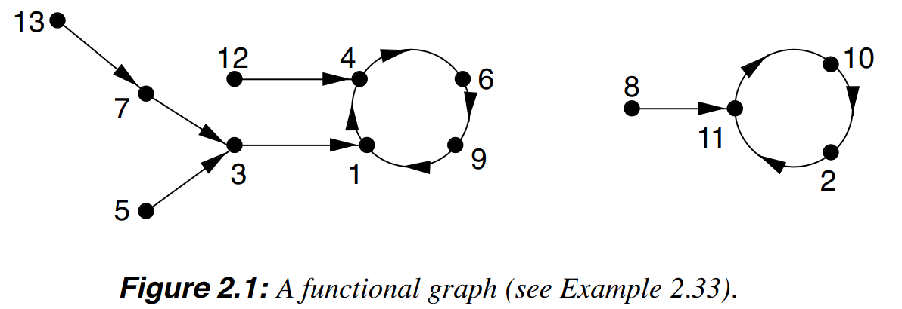
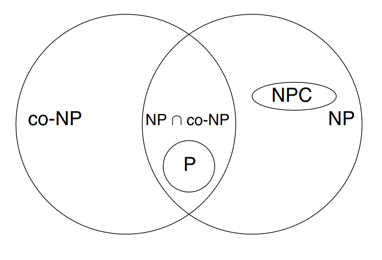
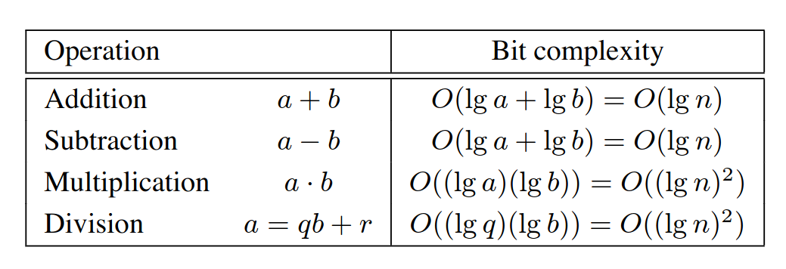
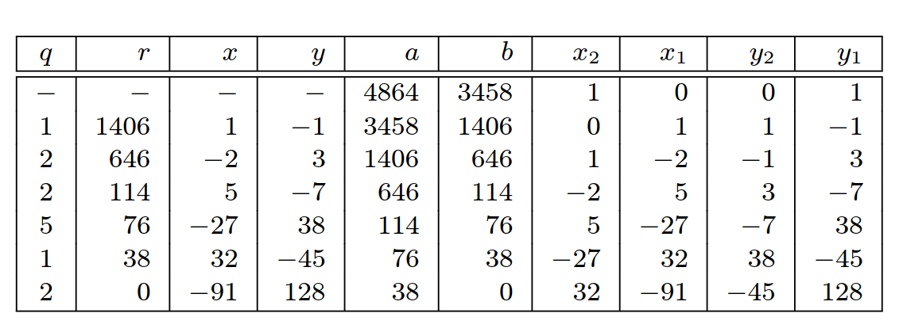
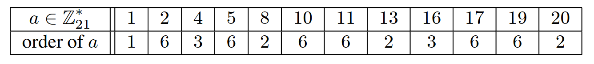
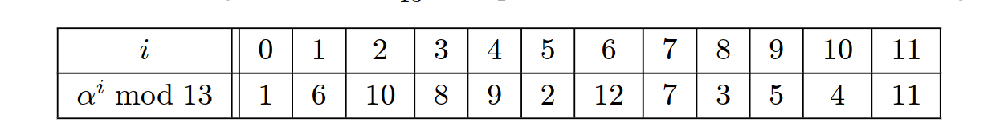
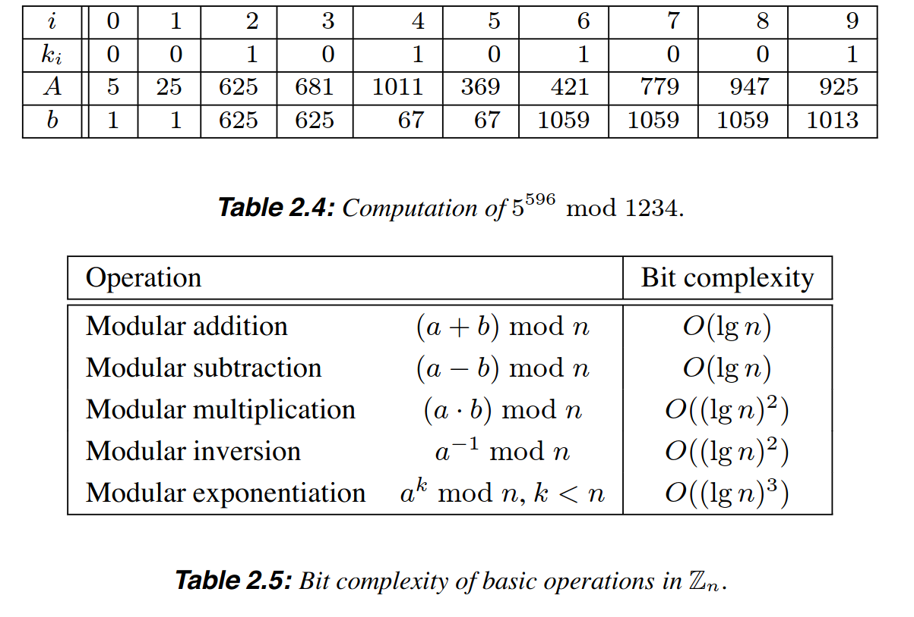
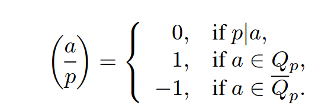
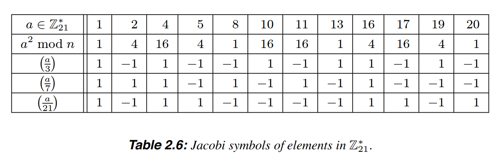

# Mathematical Background
## Notations
- **Z** denotes the set of integers
- **Q** denotes the set of rational numbers
- **R** denotes the set of real numbers
- π = 3,14159
- **e** is the base of the natural logarithm; **e**~=2,17828
- [**a**,**b**] denotes the intefers **x** satisfying **a**<=**x**<=**b**
- [**x**] is the largest integer less than or equal to **x**. Ex: [5.2] = 5 and [-5.2] = -6
- [**x**] is the smallest integer greater than or equal to **x**. Ex: [5.2] = 6 and [-5.2] = -5
- If **A** is a finite set, then |**A**| denotes the number of elements in **A**, called the cardinality of **A**
- **a** E **A** means that element **a** is a member of the set **A**
- **A** C/ **B** means that **A** is a subset of **B**
- **A** C **B** means that **A** is a subset of **B**, that is **A** C/ **B** and **A** != **B**
- Intersection of sets is **A** ∩ **B**
- Union of sets is **A** ∪ **B**
- The difference of sets is **A** - **B**
- The cartesian product of sets **A** and **B** is the set **A** X **B** = {(**a**,**b**)|**a** E **A** and **b** E **B**}. Example: {**a_1**,**a_2**} X {**b_1**,**b_2**,**b_3**} = {(**a_1**,**b_1**),(**a_1**,**b_2**),(**a_1**,**b_3**),(**a_2**,**b_1**),(**a_2**,**b_2**),(**a_2**,**b_3**)}
- **f**: **A** -> **B**, means the f(**a**)=**b**, where **a** E **A** and **b** E **B**. **A** is the domain(**a** is the object) and **B**(**b** is the image) the codomain
- **f**: **A** -> **B** is 1-1 or injective if each element of **B** is the image of at most one element in **A**
- **f**: **A** -> **B** is onto or surjective if each **b** E **B** is the image of at least one **a** E **A**
- **f**: **A** -> **B** is a bijection if it is both 1-1 and onto. if **f** is a bijection between finite sets **A** and **B**, then |**A**|=|**B**|(ex: A{1,2,3} B(10,9,11)). If **f** is a bijection between set **A** and itself, then **f** is called a permutation on **A**(ex: f(1)=2 f(2)=3 f(3)=1, the domain is **A** and also the codomain is **A**)
- **ln**(**x**) is the natural logarithm of **x**; that is the logarithm of **x** to the base **e**
- **lg**(**x**) is the logarithm of **x** to the base 2
- **exp**(**x**) is the exponential function **e**^(**x**)
- The expression bellow denotes the sum **a_1**+**a_2**+...+**a_n**
  ```
  / n
  |     a_i
  \ i=1
  ```
- The following expression denotes the produc **a_1** x **a_2** x ... x **a_n**
  ```
  __ n
  ||    a_i
    i=1
  ```
- for a positive integer **n**, the factorial function is **n**! = **n**(**n**-1)(**n-2**)...1. 0! = 1
## Probability Theory
### Definition 
- An **experiment** is a procedure that yields one of a given set of outcomes. 
- **simple events** are individual possible outcomes
- **sample space** is the set of all possible outcomes
- **discrete sample spaces** are the most common samples in this chaper and it is **sample spaces** with only finitely many possible outcomes
- Simple events of a sample space **S** will be labeled **S_1**,**S_2**,...,**S_n**
### Definition 
- A **probability distribution** **P** on **S** is a sequence of numbers **p_1**,**p_2**,...,**p_n** that are all non-negative and sum to 1
- The number **p_i** is interpreted as the probability of **s_i** being the outcome of the experiment
### Definition 
- An event **E** is a subset of the sample space **S**
- The probability that event **E** occurs, denoted **P**(**E**),is the sum of the probabilities **p_i** of all simple events **s_i** which belong to **E**
- If **s_i** E **S**,**P**({**s_i**}) is simply denoted by **P**(**s_i**)
### Definition
- If **E** is an event, the **complementary event** is the set of simple events not belong to **E**, denoted **E**^-
### Fact
- Let **E** ⊆ **S**
- 0 <= **P**(**E**) <= 1, **P**(**S**) = 1 and **P**(**θ**) = 0 (**θ** is the empty set)
- **P**(**E**^-) = 1 - **P**(**E**)
- If the outcomes in **S** are equally likely, then **P**(**E**) = |**E**| / |**S**|
### Definition
- Two events **E_1** and **E_2** are called **mutually exclusive** if **P**(**E_1**∩**E_2**)=0
- This means that by one happening the other is ommited
### Fact
- Let **E_1** and **E_2** be two events
- If **E_1** ⊆ **E_2** then **P**(**E_1**) <= **P**(**E_2**)
- **P**(**E_1**∪**E_2**)+**P**(**E_1**∩**E_2**)=**P**(**E_1**)+**P**(**E_2**)
- Case **E_1** and **E_2** are mutually exclusive, then **P**(**E_1**∪**E_2**)=**P**(**E_1**)+**P**(**E_2**)
## Conditional Probability
### Definition
- **E_1** and **E_2** two events with **P**(**E_2**) > 0
- The **conditional probability** of **E_1** given **E_2**,denoted **P**(**E_1**|**E_2**) is **P**(**E_1**|**E_2**)=**P**(**E_1**∩**E_2**)/**P**(**E_2**)
- **P**(**E_1**|**E_2**) means the probability of event **E_1** occurring, given that **E_2** has ocurred
### Definition
- Events **E_1** and **E_2** are **independent** if **P**(**E_1**∩**E_2**)=**P**(**E_1**)x**P**(**E_2**)
- If **E_1** and **E_2** are independent, then **P**(**E_1**|**E_2**)=**P**(**E_1**) and **P**(**E_2**|**E_1**)=**P**(**E_2**), this means that the occurence of one does not influence the ocurrence of the another
### Fact
- If **E_1** and **E_2** are events with **P**(**E_2**)>0, then **P**(**E_1**|**E_2**)=(**P**(**E_1**)x**P**(**E_2**|**E_1**))/**P**(**E_2**)
## Random variables
- Let **S** be a sample space with probability distribution **P**
### Definition
- A random variable **X** is a function from the sample space **S** to the set of real numbers
- to each simple event **s_i** E **S**
- **X** assigns a real number **X**(**s_i**)
- Since **S** is assumed to be finite, **X** can only take on a finite number of values
### Definition
- **X** is a random variable on **S**
- The **expected value** is:
  ```
  /
  | X(s_i)xP(s_i)
  \ 
    s_i E S
  ```
### Fact
- **X** is a random variable on **S**
- Then:
  ```
  /
  | (x) x P(X=(x))
  \
    x E R
  ```
### Fact
- If **X_1**,**X_2**,...,**X_m** are random variables on **S**
- And **a_1**,**a_2**,...,**a_m** are real numbers, then:
  ```
        m                m
    ( /           )    /
  E( |  a_i x X_i ) = | a_i x E(X_i)
    ( \           )    \
        i=1              i=1 
  ```
### Definition
- The variance of a random variable **X** of mean **u** is a non-negative number **VAR**(**X**)=**E**((**X**-**u**)^2)
- The standard deviation of **X** is the non-negative square root of **Var**(**X**)
- If a random variable has small variance then large deviations from the mean are unlikely to be observed
### Fact
- **X** is a random variable with mean **u** = **E**(**X**) and variance **o**^2 = **VAR**(**X**)
- Then for any **t** > 0:
  ```
  P(|X-u| >= t) <= ((o^2)/(t^2))
  ```
## Binomial Distribution
### Definition
- **n** and **k** are non-negative integers
- The binomial coefficient $\binom{n}{k}$
- is the number of diferent ways of choosing **k** distinct objects from a set of **n** distinct objects
- the order is not important
### Fact (properties of binomial coefficients)
- **n** and **k** are non-negative integers
1. $\binom{n}{k}$ = $\frac{n!}{k!*(n-k)!}$  
2. $\binom{n}{k}$ = $\frac{n}{n-k}$
3. $\binom{n+1}{k+1}$ = $\binom{n}{k}$ + $\binom{n}{k+1}$
```
(
  n+1 = (         (
  k+1     n   +    n
)         k        k+1  
        )          ) 
```
### Fact (binomial theorem)
- For any real numbers **a**,**b** and non-negative integer **n**
- $(a+b)^n$=$\sum_{k=0}^{n}$$\binom{n}{k}$$*$$a^{k}$$*$$b^{n-k}$
### Bernoulli trial
- Experiment with exacly two possible outcomes
- These two possible outcomes are called success and failure
### Fact
- Suppose that the probability of success on a particular Bernoulli trial is **p**
- Then the probability of exacly **k** successes in a sequence of **n** such independent trials is: $$\binom{n}{k}$$ $$p^k$$ $$(1-p)^{n-k}$$, for each $$0 \le k \le n$$
### Definition
- The probability distribution is called **binomial distribution**
### Fact
- The expected number of successes in a sequence of **n** independent Bernoulli trials, with probability **p** of success in each trial, is **np**
- The variance of the number of successes is **np**(1-**p**)
### Fact (law of large numbers)
- **X** is a random variable denoting the fraction of sucesses in **n** independent Bernoulli trials
- **p** is the probability of success in each trial
- Then for any **e** > 0, **P**(|**X**-**p**|$>$**e**) -> 0, as **n** -> $\infty$
- In other words, as **n** gets larger, the proportion of successes should be close to **p**
## Birthday problems
1.
- For positive integers **m**,**n**
- With **m**>=**n**
- The number $m^{(n)}$ = **m**(**m**-1)(**m**-2)...(**m**-**n**+1)
2.
- **m**,**n** are non-negative integers with **m** >= **n**
- The stirling number of the second kind, denoted like $\left\{\frac{m}{n}\right\}$ is: $\left\{\frac{m}{n}\right\}$ = $\frac{1}{n!}$  $*$ $\sum_{k=0}^{n}$ $*$ $(-1)^{n-k}$ $*$ $\binom{n}{k}$ $*$ $k^{m}$
- The exception is that $\left\{\frac{0}{0}\right\}$ = 1
- $\left\{\frac{m}{n}\right\}$ counts the number of ways of partioning a set of **m** objects into **n** non-empty subsets
### Fact (classic occupancy problem)
- An urn has **m** balls numbered 1 to **m**
- **n** balls are drawn from the urn one at a time, with replacement, and they numbers are listed
1.
- The probability of at least one coincidence (a ball drawn at least twice) is: $P_{1}$(m,n,t) = $\binom{n}{t}$ $*$ $\frac{m^{(t)}}{n^{(n)}}$, $1 \le t \le n$
### Fact (birthday problem)
- An urn has **m** balls numbered 1 to **m**
- **n** balls are drawn from the urn one at a time. With replacement and the numbers are listed
1.
- The probability of at least one coincidence (a ball get drawn twice) is: $P_2(m,n)$=1-$P_1(m,n,n)$=1-$\frac{m_{(n)}}{m_n}$,$1 \le n \le m$
- If n=O($\sqrt{m}$) and m -> $\infty$
- Then $P_2$(m,n) -> 1 - exp($\frac{-n(n-1)}{2*m}$+O($\frac{1}{\sqrt{m}}$)) $\approx$ 1 - exp($\frac{-n^{2}}{2*m}$)
2.
- As m->$\infty$, the expected number of draws before a coincidence is $\sqrt{\frac{\pi*m}{2}}$
#### Explanation (why probability distribution is refered as birthday surprise or birthday paradox)
- The probability of 2 people in a room of 23 people having the same birthday is $P_{2}$(365,23) $\approx$ 0.507
- This number is "large"
- $P_2$(365,n) increases rapidly as **n** increases
### Facts
- There are 2 urns
- One containing **m** white balls numbered 1 to **m**
- The other contains **m** red balls numbered 1 to **m**
- First, $n_1$ balls are selected from the first urn and their numbers listed
- Then $n_2$ balls are selected from the second urn and their numbers listed
- The number of **coincidences** between the two lists are counted
#### Model A
- In case the balls are drawn one at a time
- With replacement
- The probability of at least one coincidence is $P_3$(m,$n_1$,$n_2$) = 1 - $\frac{1}{m^{n_1+n_2}}$ * $\sum_{t_1,t_2}$$m^{t_1+t_2}$ $\left\{\frac{n_1}{t_2}\right\}$ $\left\{\frac{n_2}{t_2}\right\}$. The summation is over all $0 \le t_1 \le n_1$,$0 \le t_2 \le n_2$
- Case the n=$n_1$=$n_2$,n=O($\sqrt{m}$) and m->$\infty$
- then $P_3$(m,$n_1$,$n_2$) -> 1 - exp(-$\frac{n^{2}}{m}$ $*$ [1+O($\frac{1}{\sqrt{m}})$]) $\approx$ 1 - exp(-$\frac{n^{2}}{m}$)
### Model B
- If the balls from both urns are drawn without replacement, then the probability of at least one coincidence is is $P_4$(m,$n_1$,$n_2$)=1-$\frac{m^{(n_1+n_2)}}{m^{(n_1)}*m^{(n_2)}}$.
- If $n_1$=O($\sqrt{m}$),$n_2$=O($\sqrt{m}$),and m -> $\infty$
- Then $P_4$(m,$n_1$,$n_2$)->1-exp(-$\frac{n_1*n_2}{m}$*[1+$\frac{n_1+n_2-1}{2*m}$+O($\frac{1}{m}$)])
### Model C
- If the $n_1$ white balls are drawn one at a time, with replacement, and the $n_2$ red balls are drawn without replacement
- Then the probability of at least one coincidence is: $P_5$(m,$n_1$,$n_2$)=1-$(1-\frac{n_2}{m})^{n_1}$
- If $n_1$ = O($\sqrt{m}$),$n_2$=O($\sqrt{m}$) and m->$\infty$ then $P_5$(m,$n_1$,$n_2$) -> 1 - exp(-$\frac{n_1*n_2}{m}$*[1+O($\frac{1}{\sqrt{m}})$]) $\approx$ 1-exp(-$\frac{n_1*n_2}{m}$)
## Random mappings
- Let $F_n$ denote the collection of all functions (mappings) from a finite domain of size **n** to a finite codomain of size **n**
- Models where random elements of $F_n$ are considered are called **random mappings models**
- such models arise frequently in cryptography and algorithmic number theory
- |$F_n$|=$n^{n}$
- The probability that a particular function from $F_n$ is chosen is $\frac{1}{n^{n}}$
### Another definition
- Let **f** be a function in $F_n$ with domain and codomain equal to {1,2,...,**n**}
- The functional graph of **f** is a directed graph whose points (or vertices) are the elements {1,2,...,**n**} and whose edges are the orderer pairs (**x**,f(**x**)) for all **x** $\in$ {1,2,...,**n**}
### example of a Functional graph
- **f**: {1,2,...,13} -> {1,2,...,13}
- f(1) = 4
- f(2) = 11
- f(3) = 1
- f(4) = 6
- f(5) = 3
- f(6) = 9
- f(7) = 3
- f(8) = 11
- f(9) = 1
- f(10) = 2
- f(11) = 10
- f(12) = 4
- f(13) = 7

### Fact
- As **n** tends to infinity, the following statements regarding the functional graph of a random function **f** from $F_n$ are true:
1. The expected number of components is $\frac{1}{2}$*ln(**n**)
2. The expected number of points which are on the cycles is $\sqrt{\frac{\pi * n}{2}}$
3. The expected number of **terminal points** (points which have no preimages) is $\frac{n}{e}$
4. The expected number of **k**-th iterate image points (**x** is a **k**-th iterate image point if **x**=f(f(...f(y)...)) for some **y**) is (1-$T_k$)*n, where $T_k$ satisfy the recurrence $T_0$=0,$T_{k+1}$=$e^{-1+T_k}$ for k $\ge$ 0 
### Another definition
- Let **f** be a random function from {1,2,...,**n**} to {1,2,...,**n**} and let **u** $\in$ {1,2,...,**n**}
- Considere the sequence of points $u_0,u_1,u_2,...$ defined by $u_0=u,u_i=f(u_{i-1})$ for $i \ge 1$
- In the graph of f, this sequence describes a path that connects to a cycle
1. The number of edges in the path is called the tail length of u,denoted &lambda;(u)
2. The number of edges in the cycle is called the cycle length of u,denoted &mu;(u)
3. The rho-length of u is the quantity p(u)=&lambda;(u)+&mu;(u)
4. The tree size of u is the number of edges in the maximal tree rooted on a cycle in the component that contains u.
5. The component size of u is the number of edges in the component that contains u.
6. The prodecessors size of u is the number of iterated preimages of u.
### Example
- The functional graph in figure 2.1 has 2 components and 4 terminal points
- The point u=3 has parameters &lambda;(u)=1,&mo;(u)=4,p(u)=5
- The tree,component and predecessors sizes of u=3 are 4,9 and 3
### Fact
- As n tends to infinity
- There are expectatons of some parameters associated with a random point in {1,2,...,n} and a random function from $F_n$
1. Tail length: $\sqrt{\frac{\pi*n}{8}}$
2. Cycle length: $\sqrt{\frac{\pi*n}{8}}$
3. Rho length: $\sqrt{\frac{\pi*n}{2}}$
4. Tree size: $\frac{n}{3}$
5. Component size: $\frac{2n}{3}$
6. predecessors size: $\sqrt{\frac{\pi*n}{8}}$
### Fact
- As n tends to infinity 
- the expectations of the maximum tail,cycle, and rho lengths in a random function from $F_n$ are $c_1$$\sqrt{n}$,$c_2$$\sqrt{n}$ and $c_3$$\sqrt{n}$,respectively,where $c_1$$\approx$ 0,78248, $c_2$$\approx$ 1,73746 and $c_3$$\approx$ 2,4149
## Information theory
### Entropy
- Let X be a random variable which takes a finite set of values $x_1$,$x_2$,...$x_n$ with probability P(X=$x_i$)=$p_i$ where $0 \le p_i \le 1$
- for each i, $1 \le i \le n$ and where $\sum_{i=1}^n$$p_i$=1
- Y and Z are random variables which take on finite sets of values
- The entropy of X is a mathematical measure of the amount of information provided by an observation of X
- It is also the uncertainity about the outcome before an observation of X
- Entropy is also useful for approximating the average number of bits required to encode the elemnts of X
### Definition
- The entropy of uncertainty of X is defined to be H(X)=-$\sum_{i=1}^n$$p_i$$*$lg$*$$p_i$=$\sum_{i=1}^n$$p_1$$*$lg$*$lg($\frac{1}{p_i}$) where by convention $p_i$*lg $p_i$ = $p_i$ * lg ($\frac{1}{p_i}$)=0 if $p_i$=0
### Fact (properties of entropy)
- Let X be a random variable which takes on n values
1. $0 \le H(X) \le lg(n)$
2. H(X)=0 if and only if $p_i$=1 for some i, and $p_j$=0 for all j$\ne$i
3. H(X)=lg(n) if and only if $p_i$=$\frac{1}{n}$ for each i,$1 \le i \le n$ (all the outcomes are equally likely)
### Definition (The joint entropy of X and Y is defined to be)
- H(X,Y)=-$\sum_{x,y}$P(X=x,Y=y)$*$lg(P(X=x,Y=y))
- Where the summation indices x and y range over all values of X and Y,respectively
- The definition can be extended to any number of random variables 
### Fact
- If X and Y are random variables
- $H(X,Y) \le H(X) + H(Y)$, with equality if and only if X and Y are independent
### Definition
- If X,Y are random variables
- The conditional entropy of X and given Y = y is H(X|Y=y)=-$\sum_{x}$$P(X=x|Y=y)$$*$lg(P(X=x|Y=y))
- Where the summation index x ranges over all values of X
- The conditional entropy of X given Y, also called the equivocation of Y about X, is H(X|Y) = $\sum_{y}$P(Y=y)H(X|Y=y), where the summation index y ranges over all values of Y
### Fact (properties of conditional entropy)
- Let X and Y be random variables
1. The quantity H(X|Y) measures the amount of uncertainty remaining about X after Y has been observed
2. H(X,Y)$\ge$ 0 and H(X|X)=0
3. H(X,Y)=H(X)+H(Y|X)=H(Y)+H(X|Y)
4. H(X|Y)$\le$H(X),with equality if and only if X and Y are independent
## Mutual information
### Definition (mutual information or transinformation of random variables X and Y)
- it is I(X;Y)=H(X)-H(X|Y) when the random variables are X and Y
- it is also I(X;Y,Z)=H(X)-H(X|Y,Z) when the random variables are X and the pair Y,Z
### Fact (properties of mutual transformation)
1. The quantity I(X;Y) can be thought of as the amount of information that Y reveals about X
The quantity I(X;Y,Z) can be thought as the amount of information Y and Z reveal about X
2. I(X;Y)$\ge$ 0
3. I(X;Y)=0 if and only if X and Y are independent (that is, Y contributes no information about X)
4. I(X;Y)=I(Y;X)
### Definition (the conditional transformation)
- The conditional transiformation of the pair X,Y given Z is defined to be $I_Z$(X;Y)=H(X|Z)-H(X|Y,Z)
### Fact (properties of conditional transiformation)
1. The quantity $I_Z$(X;Y) can be interpreted as the amount of information that Y provides about X,given that Z has already been observed
2. I(X;Y,Z)=I(X;Y)+$I_Y$(X;Y)
3. $I_Z$(X;Y)=$I_Z$(Y;X)
## Complexity Theory
- Main goal is to provide mechanisms for classifying computational problems according to the resources needed to solve them
- Classification could not depend on a particular computational model
- It should measure the intrinsic difficulty of the problem
- Resources measured may include time,storage space,random bits,number of processors,etc..
- The main thing is time and sometimes space
- Algorithm is a well-defined computational procedure that takes a variable input and halts with an output
- The term "well-defined computational procedure" is not mathematically precise
- It can be made so by using formal computational models such as **Turing machines**,**random acess** machines or **boolean circuits**
### Definition
- The size of a input is the total number of bits needed to represent the input in ordinary notation using an appropriate encoding scheme
- Sometimes it can be the number of items of the input
### Example (Sizes of some objects)
1. The number of bits in the binary representation of a positive integer n is 1+[lg(n)] bits. For simplicity, the size of n will be approximated by lg(n)
2. If f is a polynomial of degree at most k, eacho coefficient being a non-negative integer at most n, then the size of f is (k+1)log(n) bits
3. If A is a matrix with r rows,s columns, and with non-negative integer entries each at most n, then the size of A is r$*$s$*$log(n) bits
### Definition running time of a algorithm
- The running time of a algorithm on a particular input is the number of primitive operations or steps executed
- Often a step is taken to mean a bit operation
- For some algorithms it will be more convenient to take step to mean something else such as a comparison, a machine instruction,a machine clock cycle, a modular multiplication,etc..
### Definition worst-case running time
- The worst-case running time of a algorithm is an upper bound on the running time of any input, expressed as a function of a input size
### Definition average-case running time
- The average-case running time of a algorithm is the average running time over all inputs of a fixed size, expressed as a function of the input size
## Asymptotic notation
- It is often difficult to derive the exact running time of a algorithm
- In such situations we are forced to settle approximations of the running time (this is called asymptotic running time)
- This is the study of how the time of the algorithm increases as the size of the input increases without bound
- The only functions considered are those which are defined on the positive integers and take on real values that are always positive from some point onwards
- Let f and g be two such functions
### Definition orderer notation
1. (asymptotic upper bound)f(n)=O(g(n)) if there exists a positive constant c and a positive integer $n_0$ such that $0 \le f(n) \le cg(n)$ for all $n \ge n_0$
2. (asymptotic lower bound)f(n)=$\Omega$(g(n)) if there exists a positive constant c and a positive integer $n_0$ such that $0 \le cg(n) \le f(n)$ for all $n \ge n_0$
3. (asymptotic tight bound)f(n)=$\Theta$(g(n)) if there exist positive constants $c_1$ and $c_2$, and a positive integer $n_0$ such that $c_1 g(n) \le f(n) \le c_2 g(n)$ for all $n \ge n_0$
4. (o-notation)f(n)=o(g(n)) if for any positive constant c>0 there exists a constant $n_0 > 0$ such that $0 \le f(n) < cg(n)$
- f(n)=O(g(n)) means that f grows no faster asymptotically than g(n) to within a constant multiple, while f(n)=$\Omega$(g(n)) means that f(n) grows at least as fast assymptically as g(n) to within a constant multiple.f(n)=o(g(n)) means that g(n) is an upper bound for f(n) that is not asymptotically tight, or in other words, the function f(n) becomes insignificant relative to g(n) as n gets large. The expression o(1) is often used to signify a function f(n) whose limit as n approaches $\infty$ is 0
### Fact (properties of order notation)
- For any functions f(n),g(n),h(n) and l(n), the following are true
1. f(n)=O(g(n)) if and only if g(n)=$\Omega$(f(n))
2. f(n)=$\Theta$(g(n)) if and only if f(n)=O(g(n)) and f(n)=$\Omega$(f(n))
3. If f(n)=O(h(n)) and g(n)=O(h(n)), then (f+g)(n)=O(h(n))
4. If f(n)=O(h(n)) and g(n)=O(l(n)), then (f·g)(n)=O(h(n)l(n))
5. (relexivity)f(n)=O(f(n))
6. (transitivity) if f(n)=O(g(n)) and g(n)=O(h(n)),then f(n)=O(h(n))
### Fact (approximations of some commonly occuring functions)
1. (polynomial function) If f(n) is a polynomial of degree k with positive leading term, then f(n)=$\Theta$($n^k$)
2. For any constant $c>0,log_c n=\Theta(lg(n))$
3. (Stirling's formula) for all integers $n \ge 1$,
- $\sqrt{2 \pi n}(\frac{n}{e})^n \le n! \le \sqrt{2 \pi n}(\frac{n}{e})^{n+(\frac{1}{12n})}$
- Thus n!=$\sqrt{2 \pi n}(\frac{n}{e})^{n}(1+\Theta(\frac{1}{n}))$
- n!=$o(n^n)$ and n!=$\Omega(2^n)$
4. lg(n!)=$\Theta(n lg(n))$
### Example (comparative growth rates of some functions) 
- Let e and c be arbitrary constants with $0< e < 1 < c$. The following functions are listed in increasing order of their asymptotic growth rates: $1<ln ln(n)<ln(n)<exp(\sqrt{ln n ln ln n})<n^{\epsilon}<n^c<n^{ln n}<c^n<n^n<c^{c^{n}}$
## Complexity classes
- A polynomial-time algorithm is a algorithm whose worst-case running time function is of the form $O(n^k)$, where n is the input size and k is a constant
- Any algorithm whose running time cannot be so bounded is called an exponential-time algorithm
- Roughly speaking, polynomial-time algorithms can be equated with good or efficient algorithms, while exponential-time algorithms are considered inefficient
- There are however, some practical situations when this distinction is not appropriate
- When considering polynomial-time complexity, the degree of the polynomial is significant
- For example tought algorithm with a running time of $O(n^{ln ln n})$, n beeing the input size, is asymptotically slower than a algorithm with a running time of $O(n^{100})$, the former algorithm may be faster in practise for smaller values of n, especially if the constant hidden by the big-O notation are smaller
- Furthermore, in cryptography, average-case complexity is more important than worst-case complexity
- A necessary condition for an encryption scheme to be considered secure is that the corresponding cryptanalysis problem is difficult on average(or more precisely,almost always difficult), and not just for some isolated cases
### Definition subexponential-time algorithm
- A subexponential-time algorithm is an algorithm whose worst-case running time function if of the form $e^{o(n)}$,where n is the input size
- A subexponential-time algorithm is asymptotically faster than an algorithm whose running time is fully exponential in the input size, while it is asymptotically slower than a polynomial-time algorithm
### Example (subexponential running time)
- Let A be an algorithm whose inputs are either elements of a finite Field $F_q$, or a integer q. If the expected running time of A is of the form: $L_q[\alpha,c]=O(exp((c+o(1))(ln(q)^{\alpha}(lnlnq)^{1-\alpha})))$
- Where c is a positive constant and $alpha$ is a constant satisfying $0 < \alpha < 1$, then A is a subexponential-time algorithm
- For $\alpha = 0, L_q[0,c] is a polynomial in ln(q), while for \alpha = 1,L_q[1,c]$ is a polynomial in q, and thus fully exponential in ln q.
- For simplicity, the theory of computational complexity restricts its attention to decision problems. ex: Prolems which have either YES or NO as answer
- This is not to restricted in practise, as all the computational problems that whill be encountered here can be phrased as decision problems in such a way that a efficient algorithm for the decision problem yields an efficient algorithm for the computational problem and vice versa
### Definition (complexity class)
- The complexity class P is the set of all decision problems that are solvable in polynomial time
- The complexity class NP is the set of all decision problems for which a YES answer can be verifed in polynomial time given some extra information, called a certificate
- The complexity class co-NP is the set of all decision problems for each a NO answer can be verified in polynomial time using an appropriate certificate
- If a decision is in NP, it may not be the case that the certificate of a YES answer can be easily obtained. What is asserted is that such a certificate does not exist, and, if known can be used to efficiently verify the YES answer. The same is true of the NO answers for problems in co-NP
### Example (problem in NP)
- The instance is a positive integer n
- The question is: "Is n composite?". That is, are there integers a,b > 1 such that n = ab?
- Composites belongs to NP because if an integer n is composite, then this fact can be verified in polynomial time if one is given a divisor a of n, where $1<a<n$(the certificate in this case consists of the divisor a). It is in fact also the case that COMPOSITES belongs to co-NP. It is still unknown wheter or not COMPOSITES belong to P
### Fact P $\subseteq$ NP and P $\subseteq$co-NP
- The following are among the outstanding unresolved questions in the subject of complexity theory:
1. Is P=NP?
2. Is NP=co-NP?
3. Is P=NP $\cap$ co-NP
- Mot of the experts believe that the answer is NO
### Defition 
- Let $L_1$ AND $L_2$ be two decision problems. $L_1$ is said to polytime reduce to $L_2$, written $L_1 \le_P L_2$
- If there is a algorithm that solves $L_1$ which uses, as a subroutine,an algorithm for solving $L_2$, and which runs in polynomial time if the algorithm for $L_2$ does
- Informally, if $L_1 \le_P L_2$, then $L_2$ is at least as difficult as $L_1$, or, equivalently, $L_1$ is no harder than $L_2$
### Definition
- Let $L_1$ and $L_2$ be two decision problems. If $L_1 \le_P L_2$ and $L_2 \le_P L_1$, then $L_1 and L_2$ are said to be computationally equivalent
### Fact
- Let $L_1,L_2, and L_3$ be three decision problems
1. (transitivity) If $L_1 \le_P L_2$ and $L_2 \le_P L_3$, then $L_1 \le_P L_3$
2. If $L_1 \le_P L_2$ and $L_2$  $\in$  P, then $L_1$ $\in$ P
### Defition 
- A decision problem L is said to be NP-complete if
1. L $\in$ NP, and
2. $L_1$ $\le_P$ L for every $L_1$ $\in$ NP
- The class of all NP-complete problems is denoted by NPC
- NP-complete problems are the hardest problems in NP in the sene that they are at least as difficult as every other problem in NP. There are thousands of problems drawn from diverse fields such as combinatorics,number theory and logic. That are known to be NP-complete
### Example (subset sum problem)
- The subset sum problem is the following: 
    - given a set of positive integers {$a_1,a_2,...,a_n$} and a positive integer s,determine whether or not there is a subset of the $a_i$ that sum to s. The subset sum problem is NP-complete
### Fact
- Let $L_1$ and $L_2$ be two decision problems
1. If $L_1$ is NP-complete and $L_1$ $\in$ P, then P=NP
2. If $L_1$ $\in$ NP, $L_2$ is NP-complete, and $L_2 \le_P L_1$, then $L_1$ is also NP-complete
3. If $L_1$ is NP-complete and $L_1$ $\in$ co-NP, then NP=co-NP

### Definition
- A problem is NP-hard if there exists some NP-complete problem that polytime reduces to it
- Np-hard is not only to decision problems
- NP-complete is also NP-hard
### Example(NP-hard problem)
- Given positive integers $a_1,a_2,...a_n$ and a positive integer s
- The computational version of the subset sum problem would ask to actually find a subset of the $a_i$ which sums to s, provided such a subset exists. This problem is NP-hard.
## Randomized algorithms
- The algorithms studied so far in this section are deterministic
- They follow the same path of operations so far
- Randomzied algorithm makes random decisions at certain points in the execution
- The random decisions are based in random number generators
- In some cases they are better than the deterministic
### Definition
- Let A be a randomized algorithm for a decision problem L, and let I denote an arbitrary instance of L
1. A has 0-sided error if P(A outputs YES|I's answer is YES)=1,and P(A outputs YES|I's answer is NO)=0
2. A has 1-sided error if P(A outputs YES|I's answer is YES)$\ge$$\frac{1}{2}$, and P(A outputs YES|I's answer is NO)=0
3. A has 2-sided error if P(A outputs YES|I's answer is YES)$\ge$$\frac{2}{3}$, and P(A outputs YES|I's answer is NO)$\le$$\frac{1}{3}$
The number $\frac{1}{2}$ in the definition of 1-sided error is somewhat arbitrary and can be replaced by any positive constant. Similarly, the numbers $\frac{2}{3}$ and $\frac{1}{3}$ in the definition of 2-sided error, can be replaced by $\frac{1}{2}$+$\in$ and $\frac{1}{2}$-$\in$,respectively, for any constant $\in$, $0 < \in < \frac{1}{2}$
### Definition
- The expected running time of a randomized algorithm is an upper bound on the expected running time for each input ( the expectation being over all outputs of the random number generator used by the algorithm), expressed as a function of the input size.
- The important randomized complexity classes are defined next
### Definition (randomized complexity classes)
1. The complexity class ZPP("zero-sided probabilistic polynomial time")is the set of all decision problems for which there is a randomized algorithm with 0-sided error which runs in expected polynomial time
2. The complexity class RP("randomized polynomial time") is the set of all decision problems for which there is a randomized algorithm with 1-sided error which runs in worst-case polynomial time
3. The complexity class BPP("bounded error probabilistic polynomial time") is the set of all decision problems for which there is a randomized algorithm with 2-sided error which runs in (worst-case) polynomial time
### Fact $P \in ZPP \in RP \in BPP and RP \in NP$
## Number theory
### The integers
- The set of integers {...,-3,-2,-1,0,1,2,3,...} is denoted by the symbol $\Z$
### Definition 
- Let a,b be integers. Then a divides b (equivalently: a is a divisor of b or a is a factor of b). If there exists an integer c such that b=ac. if a divides b, then this is denoted by a|b
### Example (i)-3|18, since 18=(-3)(-6).(ii)173|0,since 0=(173)(0)
### Fact (properties of divisibility) 
- For all a,b,c $\in$ $\Z$, the following are true:
1. a|a
2. IF a|b and b|c, then a|c
3. If a|b and a|c, then a|(bx + cy) for all x,y $\in$ $\Z$
4. If a|b and b|a, then a=$\pm$b
### Definition (division algorithm for integers)
- If a and b are integers with $b\ge1$, then ordinary long division of a by a yields integers q(the quotient) and r (the remainder) such that: a=qb+r,where $0\le r < b$
- q and r are unique
- The remainder of the division is denoted a mod b, and the quotient is denoted a div b
### Fact
- Let a,b $\in \Z$ with b $\ne$ 0. Then a div b = [a/b] and a mod b=a - b [a/b]
### Example
- If a=73,b=17,then q=4 and r=5.Hence 73 mod 17=5 and 73 div 17=4
### Definition
- An integer c is a common divisor of a and b if c|a and c|b
### Definition
- A non-negative integer d is the greatest common divisor of integers a and b, denoted d=gcd(a,b), if
1. d is a common divisor of a and b; and
2. whenever c|a and c|b, then c|d
- gcd(a,b) is the largest positive integer that divides both a and b, with the exception that gcd(0,0)=0
### Example
- The common divisors of 12 and 18 are {$\pm 1,\pm 2,\pm 3,\pm 6$} and gcd(12,18)=6
### Definition
- A non-negative integer d is the least common multiple of integers a and b, denoted d=lcm(a,b), if
1. a|b and b|d
2. whenever a|c and b|c, then d|c
- lcm(a,b) is also the smallest non-negative integer divisible by both a and b
### Fact
- If a and b are positive integers
- then lcm(a,b)=a·b/gcd(a,b)
### Example
- Since gcd(12,18)=6
- It follows that lcm(12,18)=12·18/6=36
### Definition
- Two integers a and b are said to be relatively prime or coprime if gcd(a,b)=1
### Definition 
- An integer $p \ge 2$ is said to be prime if its only positive divisors are 1 and $p$
- Otherwise, $p$ is called composite
### Fact
- If $p$ is prime and $p$|$ab$,then either $p$|$a$ or $p$|$b$ (or both)
### Fact
- There are an infinite number of prime numbers
### Fact (prime number theorem)
- Let $\pi$(x) denote the number of prime numbers $\le$ $x$
- Then $\lim_{x \longrightarrow \infty}$ $\frac{\pi(x)}{x/ln(x)}$=1
- This means that for large values of $x$,$\pi(x)$ is closely approximated by the expression $x/ln(x)$
- For instance, when x=$10^{10}$,$\pi$(x)=455,052,511,whereas $\lfloor x/ln(x) \rfloor$ = 434,294,481.
- A more explicit estimate for $\pi$(x) is given below
### Fact 
- Let $\pi$(x) denote the number of primes $\le x$
- Then for $x \ge 17$
- $\pi(x) > \frac{x}{ln(x)}$ and for $x>1$, $\pi(x)<1.25506\frac{x}{ln(x)}$
### Fact (fundamental theorem of arithmetic)
- Every integer $n \ge 2$ has a factorization as a product of prime powers
- n=$p^{e_1}_1 p^{e_2}_2 ... p^{e_k}_k$
- Where $p_i$ are different primes and the $e_i$ are positive integers
- Furthermore, the factorization is unique up to rearrangement of factors
### Fact
- if a=$p^{e_1}_1 p^{e_2}_2 ... p^{e_k}_k$,b=$p^{f_1}_1 p^{f_k}_k$, where each $e_i \ge 0$ and $f_i \ge 0$
- Then gcd(a,b)=$p^{min(e_1,f_1)}_1 p^{min(e_2,f_2)}_2 ... p^{max(e_k,f_k)}_k$
- and lcm(a,b)=$p^{max(e_1,f_1)}_1 p^{max(e_2,f_2)}_2 ... p^{max(e_k,f_k)}_k$
### Example
- Let a=4864=$2⁸$·19
- b=3458=2·7·13·19
- gcd(4864,3458)=2·19=38
- lcm(4864,3458)=2⁸·7·13·19=442624
### Definition
- For $n \ge 1$
- Let $\phi$(n) denote the number of integers in the interval $[1,n]$ which are relatively prime to $n$
- The function $\phi$ is called the $Euler$ $phi$ $function$
### Fact (properties of Euler phi function)
1. IF $p$ is a prime, then $\phi$(p)=p-1
2. The Euler phi function is mutiplicative. This means that if gcd(m,n)=1, then $\phi$(mn)=$\phi$(m)·$\phi$(n)
3. If n=$p^{e_1}_1 p^{e_2}_2 ... p^{e_k}_k$ is the prime factorization of $n$, then $\phi(n)=n(1-\frac{1}{p_1})(1-\frac{1}{p_2})...(1-\frac{1}{p_k})$
### Fact
- For all integers $n \ge 5$, $\phi(n)>\frac{n}{6lnlnn}$
## Algorithms in $\Z$ 
- Let $a$ and $b$ be non-negative integers each less than or equal to $n$
- The number of bit operations for the four basic integer operations of addition,subtraction,multiplication, and division using the classical algoritms is summarized in the table 

- More sophisticated techniques for multiplication and division have smaller complexities
- The euclidean algorithm is a efficient algorithm for computing the greatest common divisor of two integers that does not require the factorization of the integers
- It is based on the following simple fact
### Fact
- If $a$ and $b$ are positive integers with $a > b$, then gcd(a,b) = gcd(b,a mod b)
### Algorithm Euclidean algorithm
- Input: two non-negative integers $a$ and $b$ with $a \ge b$
- Output: the greatest common divisor of $a$ and $b$
1. While b $\neq$ 0 do the following: Set r<-a mod b, a<-b,b<-r
2. Return(a)
### Fact
- Algorithm has a running time of $O((lg n)^2)$ bit operations
### Example (Euclidean algorithm)
- The following are the division steps of Algorithm 2.104 for computing gcd(4864,3458)=38:
```
4864=1·3458+1406
3458=2·1406+646
1406=2·646+114
646=5·114+76
114=1·76+38
76=2·38+0
```
- The algorithm can be extended so that it not only yield the greatest common divisor $d$ of two integers $a$ and $b$, but also integers $x$ and $y$ satisfying $ax+by=d$
### Algorithm Extended Euclidean algorithm
- Input: two non-negative integers $a$ and $b$ with $a \ge b$
- Ouput: d = gcd(a,b) and integers $x,y$ satisfying $ax + by = d$
1. If b=0 then set d<-a,x<-1,y<-0, and return(d,x,y)
2. Set $x_2$<-1,$x_1$<-0,$y_2$<-0,$y_1$<-1
3. While $b>0$ do the following:
   
   3.1. q<-$\lfloor$a/b$\rfloor$,r<-a-qb,x<-$x_2$-q$x_1$,y<-$y_2$-q$y_1$ 

   3.2. a<-b,b<-r,$x_2$<-$x_1$,$x_1$<-x,$y_2$<-$y_1$ and $y_1$<-y
4. Set d<-a,x<-$x_2$,y<-$y_2$ and return(d,x,y)
### Fact
- The last algorithm has a running time of $O((lg(n))^2)$ bit operations
### Example

## Integers modulo $n$
- $n$ is a positive integer
### Definition
- If $a$ and $b$ are integers, then $a$ is said to be congruent to $b$ modulo $n$, written a $\equiv$ $b$ (mod $n$), if $n$ divides ($a-b$). The integer $n$ is called the modulos of the congruence
### Example
1.  24 $\equiv$ 9(mod 5) since 24-9 $\equiv$ = 3·5
2.  -11 $\equiv$ 17 (mod 7) since -11-17=-4·7 
### Fact (properties of congruences)
- For all $a,a_1,b,b_1,c \in \Z$
- The following is true:
1. $a \equiv b$ (mod $n$) if and only if $a$ and $b$ leave the same remainder when divided by $n$
2. (reflexivity) $a$ $\equiv$ $a$ (mod $n$)
3. (symmetry) If $a$ $\equiv$ $b$ (mod $n$) then $b$ $\equiv$ $a$ (mod $n$)
4. (transitivity) If $a$ $\equiv$ $b$ (mod $n$) and $b$ $\equiv$ $c$ (mod $n$), then $a$ $\equiv$ $c$ (mod $n$)
5. If $a$ $\equiv$ $a_1$(mod $n$) and $b$ $\equiv$ $b_1$ (mod $n$), then $a$+$b$ $\equiv$ $a_1 + b_1$(mod $n$) and $ab$ $\equiv$ $a_1 b_1$(mod $n$)
- The equivalence class of an integer $a$ is the set of all integers congruent to $a$ modulo $n$
- From properties 2,3, and 4 above, it can be seen that for a fixed $n$ the relation of congruence modulo $n$ partitions $\Z$ into equivalence classes
- If $a$ $\equiv$ $qn + r$, where $0 \le r < n$, then $a \equiv r$ (mod $n$)
- Hence each integer $a$ is congruent modulo $n$ to a unique integer between 0 and $n-1$,called the least residue of $a$ of a module $n$
- Thus $a$ and $r$ are in the same equivalene class, and so $r$ may simply be used to represent the equivalence class
### Definition
- The integers modulo $n$,denoted $\Z_n$, is the set of (equivalence classes of) integers {0,1,2,...,$n$-1}. Addition, subtraction, and multiplication in $\Z_n$ are performed modulo $n$
### Example
- $\Z_{25}$={0,1,2,...,24}
- In $\Z_{25}$, 13+16=4, since 13+16=29$\equiv$4(mod 25). Similarly 13·16=8 in $\Z_{25}$
### Definition 
- Let $a \in \Z_{n}$
- The multiplicative inverse of $a$ modulo $n$ is an integer $x \in \Z_{n}$ such that $ax$$\equiv$ 1 (mod $n$)
- If such an $x$ exists,then it is unique, and $a$ is said to be invertible, or a unit; the inverse of $a$ is denoted by $a^{-1}$
### Definition
- Let $a,b \in \Z_{n}$
- Divisition of $a$ by $b$ modulo $n$ is the product of $a$ and $b^{-1}$ modulo $n$,and is only defined if $b$ is invertible modulo $n$
### Fact
- Let $a \in \Z_n$. Then $a$ is invertible if and only if gcd($a$,$n$)=1
### Example
- The invertible elements in $Z_9$ are 1,2,4,5,7 and 8. For example, 4^{-1}=7 because 4·7 $\equiv$ 1 (mod 9)
### Fact
- Let $d=gcd(a,n)$
- The congruence equation $ax \equiv b$ (mod $n$) has a solution $x$ if and only if $d$ divides $b$,in which case there are exacly $d$ solutions beteen 0 and n-1;
- These solutions are all congruent modulo $n/d$
### Fact (Chinese remainder theorem,CRT)
- If the integers $n_1,n_2,...,n_k$ are pairwise relatively prime
- Then the system of simultaneous congruences

$x \equiv a_1$ (mod $n_1$)

$x \equiv a_2$ (mod $n_2$)
          
          .
          .
          .
$x \equiv a_k$ (mod $n_k$)
- has a unique solution modulo = $n_1 n_2 ... n_k$
### Algorithm
- The solution $x$ to the simultaneous congruences in the Chinese remainder theorem may be computed as $x$=$\sum^{k}_{i=1}$$a_i N_i M_i$ mod $n$
- Where $N_i = n/n_i$ and $M_i$=$N_i^{-1}$ mod $n_i$
- These computations can be performed in $O((lg n)^{2})$ bit operations
### Example 
- The pair of congruences $x \equiv 3$ (mod 7), $x \equiv 7$ (mod 13) has a unique solution $x \equiv 59$ (mod 91)
### Fact 
- If $gcd(n_1,n_2)$=1, then the pair of congruences $x \equiv a$ (mod $n_1$), $x \equiv a$ (mod $n_2$) has a unique solution $x \equiv a$ (mod $n_1 n_2$)
### Definition
- The multiplicative group of $\Z_n$ is $\Z_n^{*}$={$a \in \Z_n | gcd(a,n)=1$}
- In particular, if $n$ is a prime, then $Z_n^{*}$={$a|1 \le a \le n-1$}
### Definition
- The order of $Z_n^{*}$ is defined to be the number of elements in $Z_n^{*}$,namely |$Z_n^{*}$|
- It follows from the definition of the Euler phi function that |$Z_n^{*}$|=$\phi$(n)
- Note that if $a \in \Z_n^{*}$ and $b \in \Z_n^{*}$, then $a·b \in \Z_n^{*}$, and so $\Z_n^{*}$ is closed under multiplication
### Fact
- Let $n \le 2$ be an integer
1. If $a \in \Z_n^{*}$ then $a^{\phi(n)}$ $\equiv$ 1 (mod $n$)
2. If $n$ is a product of distinc primes, and if $r \equiv s$ (mod $\phi(n)$), then $a^r \equiv a^s$ (mod $n$) for all integers $a$. In other words, when working modulo a prime $p$, exponents can be reduced modulo $p-1$
3. In particular $a^p \equiv a$ (mod $p$) for all integers $a$
### Definition
- Let $a$ $\in$ $\Z_n^{*}$. The order of $a$,denoted $ord(a)$, is the least positive integer $t$ such that $a^t \equiv 1$ (mod $n$)
### Fact
- If the order of $a \in \Z_n^{*}$ is $t$, and $a^8 \equiv 1$ (mod $n$), then $t$ divides $s$. In particular $t|\phi(n)$
### Example
- Let n=21
- Then $\Z_{21}^{*}$={1,2,4,5,8,10,11,13,16,17,19,20}
- Note that $\phi(21)=\phi(7)\phi(3)=12=|\Z_{21}^{*}|$
- The orders of elements in $\Z_21^{*}$ are listed in table 2.3 

### Definition
- Let $\alpha \in \Z_{n}^{*}$
- If the order of $\alpha$ is $\phi(n)$
- Then $\alpha$ is said to be a generator or a primitive element of $\Z_{n}^{*}$
- If $\Z_{n}^{*}$ has a generator, then $\Z_n^{*}$ is said to be cyclic
### Fact (properties of generators of $\Z_n^{*}$)
1. $Z_n^{*}$ has a generator if only if $n$=2,4,$p^k$ or 2$p^k$, where $p$ is an odd prime and $k \ge 1$. In particular, if $p$ is a prime, then $Z_n^{*}$ has a generator
2. If $\alpha$ is a generator of $\Z_n^{*}$,then $Z_n^{*}$={$\alpha^{i}$ mod n | $0 \le$ i $\le$ $\phi$ (n) - 1}
3. Suppose $\alpha$ is a generator of $\Z_n^{*}$, Then $b=\alpha^i$ mod $n$ is also a generator of $\Z_n^{*}$ if and only if $gcd(i,\phi(n))$=1. It follows that if $Z_n^{*}$ is cyclic, then the number of generators is $\phi(\phi(n))$
4. $\alpha \in Z_n^{*}$ is a generator of $Z_n^{*}$ if and only if $\alpha^{\phi(n)/p}$ $\not\equiv$ 1 (mod $n$) for each prime divisor $p$ of $\phi(n)$
### Example 
- $\Z_{21}^{*}$  is not cycle since it doeos not contain an element of order $\phi(21)$=12
- 21 does not satisfy the condition of Fact 2.132(i)
- $\Z_{25}^{*}$ is cyclic, and has a generator $\alpha$=2
### Definition
- Let $\alpha$ $\in$ $\Z_{n}^{*}$
- a is said to be a quadractic residue module $n$ or a square modulo n,if there exists an $x$ $\in$ $\Z_{n}^{*}$ such that $x²$ $\equiv$ $a$ (mod n)
- If no $x$ exists, then a is called a quadratic non-residue module n
- The set of all quadratic residudes module n is denoted by $Q_n$ and the set of all quadratic non-residue is denoted by $\overline{Q}_{n}$
- By definition 0 $\notin$ $\Z_{n}^{*}$, whence 0 $\notin$ $Q_n$ and 0 $\notin$ $\overline{Q}_n$
### Fact
- Let p be an odd prime and let $\alpha$ be a generator of $\Z_{p}^{*}$
- Then a $\in$ $Z_{p}^{*}$ is q quadratic residue modulo $p$
- If and only if $a=a^i$ mod p, where i is an even integer
- If follows that |$Q_p$|=(p-1)/2 and |$\overline{Q}_{p}$|=(p-1)/2
- This means that half of the elements in $\Z_{p}^{*}$ are quadratic residues and the other half are quadratic non-residues
### Example
- $\alpha$=6 is a generator of $Z_{13}^{*}$
- The powers of $\alpha$ are listed in the following table

- Ence $Q_{13}$={1,3,4,9,10,12} and $\overline{Q}_{13}$={2,5,6,7,8,11}
### Fact
- Let n be a product of two distinct odd primes p and q
- n=pq
- Then a $\in$ $Z_{n}^{*}$ is a quadratic residue module $n$ if and only if a $\in$ $Q_p$ and a $\in$ $Q_q$
- It follows that |$Q_n$|=|$Q_p$|·|$Q_q$|=(p-1)(q-1)/4 and |$\overline{Q}_{n}$|=3(p-1)(q-1)/4
### Example 
- Let n=21
- $Q_{21}$={1,4,16}
- $\overline{Q}_{21}$={2,5,8,10,11,13,17,19,20}
### Definition
- Let $\alpha$ $\in$ $Q_n$
- If x $\in$ $\Z_{n}^{*}$ satisfies $x^2$ $\equiv$ a (mod n)
- x is called a square root of a modulo n
### Fact
1. if p is an odd prime a $\in$ $Q_p$, then a has exacly two square roots modulo p
2. More generally, let n = $p_{1}^{e_1}$$p_{2}^{e_2}$···$p_{k}^{e_k}$ where the $p_i$ are distinct odd primes and $e_i$ $\geq$ 1. If a $\in$ $Q_{n}$, then $a$ has precisely $2^k$ distinct square roots modulo n
### Example
- The square roots of 12 modulo 37 are 7 and 30
- The square root of 121 modulo 315 are 11,74,101,151,164,214,241 and 304
## ALgorithms in $\Z_n$
- Let $n$ be a positive integer. As before, the elements of $\Z_n$ will be represented by the integers {0,1,2,...,n-1}
- if a,b $\in \Z_{n}$, then
(a+b) mod n = $\{^{a+b, if  a+b < n,}_{a+b-n, if a+b \geq n}$
- Hence modular addition (and subtraction) can be performed without the need of a long division
- Modular multiplication of a and b may be accomplished by simply multiplying a and b as integers, and then taking the remainder of the result after division by n
- Inverses in $\Z_{n}$ can be computed using the extended Euclidean algorithm as next described
### Algorithm Computing multiplicative inverses in $\Z_n$
- Input: a $\in$ $\Z_n$
- Output: $a^{-1}$ mod n, provided that it exists

1. Use the extended Euclidean algorithm to find integers x and y such that $ax+ny=d$, where d=gcd(a,n)
2. If d > 1, then $a_{-1}$ mod n does not exist.Otherwise return(x)

- Modular exponentation can be performed efficiently with the repeated square-and-multiply algorithm
- This is crucial for many cryptographic protocols
- One version of the algorithm is based on the following observation
- Let the binary representation of k be $\sum^{t}_{i=0}$$k_i$ $2^i$, where each $k_i$ $\in$ {0,1}. Then $a^k$=$\prod^{t}_{i=0}$$a^{k_{i}2^{i}}$=$(a^{2^0})^{k_{0}}$ $(a^{2^{1}})^{k_1}$···$(a^{2^{t}})^{k_t}$
### Algorithm
- Input: a $\in$ $\Z_{n}$, and integer $0\le k < n$ whose binary representation is k=$\sum^{k}_{i=0}$ $k_{i}2^{i}$
- Output: $a^k$ mod n
1. Set b $\leftarrow$ 1. If k=0 then return(b)
2. Set A $\leftarrow$ a
3. If $k_0$=1 then set b $\leftarrow$a
4. For i from 1 to t do the following:
   
   4.1- Set A $\leftarrow$$A^2$ mod n
   4.2- If $k_i$=1 then set b $\leftarrow$A·b mod n
5. Return(b)
### Example (modular exponentiation)
- Table 2.4 shows the steps involved in computation of $5^{596}$ mod 1234=1013
- The number of bit operations for the basic operations in $\Z_n$ is summarized in table 2.5
- Efficient algorithms for performing modular multiplication and exponention are further examined in another ocasions

### The legendre and jacobi symbols
- The legendre symbol is a useful tool for keeping track of whether or not an integer a is a quadratic residue modulo a prime p
#### Definition
- Let p be an odd prime and a an integer
- The legendre symbol ($\frac{a}{p}$) is defined to be

#### Fact
- Let p be an odd prime and a,b $\in$ $\Z$. Then the legendre symbol has the following props:
1. ($\frac{a}{p}$) $\equiv$ $a^{(p-1)/2}$ (mod p). In particular, ($\frac{1}{p}$)=1 and ($\frac{-1}{p}$)=$(-1)^{(p-1)/2}$. Hence -1 $\in$ $Q_p$ if $p \equiv 1$ (mod 4), and -1 $\in$ $\overline{Q}_{p}$ if p $\equiv$ 3 (mod 4)
2. $\frac{ab}{p}$=($\frac{a}{b}$)($\frac{b}{p}$). Hence if a $\in$ $\Z_{p}^{*}$, then ($\frac{a^2}{p}$)=1
3. If a $\equiv$ b (mod p), then ($\frac{a}{p}$)=($\frac{b}{p}$)
4. ($\frac{2}{p}$)=$(-1)^{(p²-1)/8}$. Hence ($\frac{2}{p}$)=1 if p $\equiv$ 1 or 7 (mod 8), and ($\frac{2}{p}$)=-1 if p $\equiv$ 3 or 5 (mod 8)
5. (law of quadratic reciprocity) If q is an odd prime distinct from p, then ($\frac{p}{q}$)=($\frac{q}{p}$)$(-1)^{(p-1)(q-1)/4}$. In other words, ($\frac{p}{q}$)=($\frac{q}{p}$) unless both p and q are congruent to 3 modulo 4, in which case ($\frac{p}{q}$)=-($\frac{q}{p}$)
#### Definition
- Let n $\geq$ 3 be odd with prime factorization n=$p_{1}^{e^{1}}$ $p_{2}^{e_2}$···$p_{k}^{e_k}$
- Then the jacobi symbol ($\frac{a}{n}$) is defined to be ($\frac{a}{n}$)=$(\frac{a}{p_1})^{e_1}$ $(\frac{a}{p_2})^{e_2}$···$(\frac{a}{p_k})^{e_k}$
- Observe that if n is prime, then the jacobi symbol is just the Legendre symbol
#### Fact (properties of jacobi symbol)
- Let $m \geq 3$, $n \geq 3$ be odd integers,and a,b $\in$ $\Z$. Then the jacobi symbol has the following properties:
1. $(\frac{a}{n})$=0,1, or -1. Moreover, ($\frac{a}{n}$)=0 if and only if gcd(a,n) $\neq$ 1
2. ($\frac{ab}{n}$)=($\frac{a}{n}$)($\frac{b}{n}$).Hence if a $\in$ $\Z_{n}^{*}$, then $(\frac{a^2}{n})$=1
3. $(\frac{a}{mn})$=$(\frac{a}{m})$ $(\frac{a}{n})$
4. If a $\equiv$ b (mod n), then ($\frac{a}{n}$)=($\frac{b}{n}$)
5. ($\frac{1}{n}$)=1
6. ($\frac{-1}{n}$)=$(-1)^{(n-1)/2}$. Hence $(\frac{-1}{n})$=1 if n $\equiv$ 1 (mod 4), and ($\frac{-1}{n}$)=-1 if n $\equiv$ 3 (mod 4)
7. ($\frac{2}{n}$)=$(-1)^{(n^2-1)/8}$. In other words, ($\frac{m}{n}$)=($\frac{n}{m}$) unless both m and n are congruent to 3 modulo 4, in which case ($\frac{m}{n}$)=-($\frac{n}{m}$)
8. ($\frac{m}{n}$)=($\frac{n}{m}$)$(-1)^{(m-1)(n-1)/4}$. In other words, ($\frac{m}{n}$)=($\frac{n}{m}$) unless both m and n are congruent to 3 modulo 4, in which case ($\frac{m}{n}$)=-($\frac{n}{m}$). By properties of jacobi symbo it follows that if n is odd and a=$2^e_{a1}$ where $a_1$ is odd, then ($\frac{a}{n}$)=($\frac{2^e}{n}$)($\frac{a_1}{n}$)=$(\frac{2}{n})^{e}$ $(\frac{n \mod a_1}{a_1})$ $(-1)^{(a_1-1)(n-1)/4}$. This observation yields the following recursive algorithm for computing ($\frac{a}{n}$), which does not require the prime factorization of n
#### Algorithm Jacobi Symbol
- JACOBI(a,n)
- INPUT: an odd integer n $\geq$ 3, and an integer a,0$\leq$a$\leq$n
- OUTPUT: the Jacobi symbol ($\frac{a}{n}$)(and hence the Legendre symbol when n is prime)
  
  1. If a=0 then return(0)
  2. If a=1 then return(1)
  3. Write a=$2^e$a1, where $a_1$ is odd
  4. If $e$ is even then set s $\leftarrow$ 1. Otherwise set s $\leftarrow$ 1 if n $\equiv$ 1 or 7 (mod 8), or set s $\leftarrow$ -1 if n $\equiv$ 3 or 5 (mod 8)
  5. If n $\equiv$ 3 (mod 4) and $a_1$ $\equiv$ 3 (mod 4) then s $\leftarrow$ -s
  6. Set $n_1 \leftarrow n$ mod $a_1$
  7. If $a_1$ = 1 then  return(s); otherwise return(s · JACOBI($n_1,a_1$))
#### Fact 
- Algorithm 2.149 has a running time of $O((lg n)^2)$ bit operations
#### Remark (Finding quadratic non-residues modulo a prime p)
- Let p denote an odd prime
- Even tought it is known that half of the elements in $\Z_{p}^{*}$ are quadratic non-residues modulo p
- There is no deterministic polynomial-time algorithm known for finding one
- A randomized algorithm for finding a quadratic non-residue is to simply select random integer $a \in \Z_p^{*}$ until one is found satisfying ($\frac{a}{p}$)=-1
- The expected number iterations before a non-residue is found is 2 and hence the procedure takes expected polynomial-time
#### Example (jacobi symbol computation)
- For a=158 and n=235, Algorithm 2.149 computes the Jacobi symbol ($\frac{158}{235}$) as follows: ($\frac{158}{235}$) = ($\frac{2}{235}$)($\frac{79}{235}$) = (-1) ($\frac{235}{79}$)(-1)^{78·234/4}=($\frac{77}{79}$) = ($\frac{2}{77}$)=-1
- Unlike the legendre symbol, the jacobi symbol ($\frac{a}{n}$) does not reveal whether or not a is a quadratic residue modulo n. It is indeed true that if $a \in Q_n$, then  ($\frac{a}{n}$)=1. However, ($\frac{a}{n}$)=1 does not imply that $a \in Q_n$
#### Example (quadratic residues and non-residues)
- The table 2.6 lists the elements in $\Z_{21}^{*}$ and their Jacobi symbols
- Recall from Example 2.138 that $Q_{21}$={1,4,16}
- Observe that ($\frac{5}{21}$)=1 but 5 $\notin$ $Q_{21}$

#### Definition 
- Let n $\geq$ 3 be an odd integer
- $J_N$={a $\in$ $\Z_n^{*}$|$(\frac{a}{n})=1$}
- The set of pseudosquares modulo n, denoted $\widetilde{Q}_n$, is defined to be the set $J_n-Q_n$
#### Fact
- Let n=pq be a product of two distinct odd primes. Then |$Q_n$|=|$\widetilde{Q}_n$|=(p-1)(q-1)/4
- That is, half of the elements in $J_n$ are quadratic residues and the other half are pseudosquares
## Blum Integers
- A blum integer is a composite integer of the form n=pq, where p and q are distinct primes each congruent to 3 modulo 4
### Fact
- Let n=pq be a Blum integer, and let a $\in$ $Q_n$. Then a has precisely four square roots modulo n, exacly one of which is also in $Q_n$
### Definition
- Let n be a Blum integer and let a $\in$ $Q_n$
- The unique square root of a in $Q_n$ is called the principal square root of a modulo n
### Example (Blum integer)
- For the Blum integer n=21,$J_n$={1,4,5,16,17,20} and $\widetilde{Q}_{n}$={5,17,20}. The four square roots of a=4 are 2,5,16, and 19, of which only 16 is also in $Q_{21}$. Thus 16 is the principal square root of 4 modulo 21
### Fact 
- If n=pq is a Blum integer, then the function f:$Q_n \rightarrow Q_n$ defined by f(x)=$x^2$ mod n is a permutation. The inverse function of f is: $f^{-1}$(x)=x^{((p-1)(q-1)+4)/8} mod n
## Abstract Algebra
- A binary operation * on a set S is a mapping from SxS to S. That is, * is a rule which assigns to each ordered pair of elements from S an element of S
### Groups
#### Definition
- A group (G,*) consists of a set G with binary operation * on G satisfying the following three axioms:
1. The group operation is associative. That is,$a*(b*c)=(a*b)*c$ for all a,b,c $\in$ G
2. There is an element 1 $\in$ G, called the identity element, such that $a*1=1*a=a$ for all a $\in$ G
3. For each $a \in G$ exists an element $a^{-1} \in G$,called the inverse of a, such that $a*a^{-1}=a^{-1}*a=1$ 