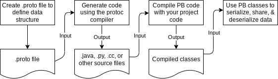

# Introduction to Protocol Buffers
- It is a language-neutral, platform-neutral extensible mechanism for serializing structured data
- Like json but smaller and faster
- It is used to get details about something, for example you can send it over the network and use it like a abi or interface of some object
- It is the data format that google uses
- [Example of protobuf](example.proto)
- This examples mentions a Person object, and the variables in it, after running the compiler, it will generate all the methods such as name() set_name(), etc.. in order to use those vars but in another system 
- We also can mention services like this [Example of protobuf2](example2.proto)
- We need to use same versions of the protobuff, otherwise the compatibility will be messed, there are huge changes between protobuf v2 and the v3
- It also has the capability that despite having new definitions, while trying to ivoke some new functionality from a old definition, it will return a default value instead of panic
- It is not recommended to use this protocol for huge data
- Not recommended for non object 

## How it works

## Syntax
- message fields can either be optional, repeated or map
    - Optional
     ```
     Those are fields that may or not be on the message
     Example:
        message UserProfile {
        string username = 1;
        int32 age = 2;
        string email = 3;
        bool isSubscribed = 4;
        }
     ```
    - repeated
     ```
     These is to the fields that may be repeated, like we can see in a array for example
     Example:
     message User {
        string username = 1;
        repeated string email = 2;
        repeated int32 phone_number = 3;
        repeated string interests = 4;
        }
     From python the object that comes from that is this:
     # Creating a user message with repeated fields
    user = User()
    user.username = "john_doe"
    user.email.extend(["john@example.com", "doe@example.com"])
    user.phone_number.extend([1234567890, 9876543210])
    user.interests.extend(["Reading", "Traveling", "Photography"])
     ```
    - map
     ```
    These is to the fields that are maps
    Example:
        message UserData {
            string username = 1;
            map<string, int32> scores = 2;
            }
     From python it would be something like this:
     # Creating a user data message with a map field
    user_data = UserData()
    user_data.username = "john_doe"
    user_data.scores["math"] = 95
    user_data.scores["history"] = 80
    user_data.scores["science"] = 92
     ```
- We can define enums, which is giving a name to a integer like this:
  ```
  enum Color{
    RED=0;
    GREEN=1;
    BLUE=2;
  }
  message ColoredShape {
  Color color = 1;
  string shape = 2;
  }
  ```
- We can define that only 1 variable will come in the message at a time
  ```
  message Address {
  oneof address_type {
    string home_address = 1;
    string work_address = 2;
    string other_address = 3;
    }
  }
  ```
## Common types
- Duration (span of time)
- Timestamp (point in time)
- Interval (interval of time)
- Date (normal date)
- DayOfWeek (normal day of the week such as monday)
- TimeOfDay (hours 10:42:23)
- LatLng(geographic pos)
- Money (money of a currency type 42 USD for example)
- PostalAddress
- Color (RGBA)
- Month

## Language Guide (proto 3)
[!] Defining a message type
```
syntax = "proto3"
message SearchRequest{
    string query = 1;
    int32 page_number = 2;
    int32 results_per_page = 3;
}
```
- We must give a number between 1 and 911
- They must be unique
- You cannot use reserved numbers and also numbers that were used in extensions
- Changing the number means deleting a field and creating another one
- Field numbers should never be reused
- We should use a number between 1 through 15 for the most frequently-set fields, because in that space it only takes 1 byte to encode, this reduces the size of the serialized data

[!] Consequences of reusing field numbers
- Ambiguous decoding (Wire format does not contain versions, so it does not understand which definition to use)
- Debugging Challenges (You can decode with one version and decode with another and that leads to debug something we dont understand)
- Parse/Merge Errors (It can lead to invalid data)
- Data Integrity/ Security Risks (You may have deleted a number for a certain parcel of data.. by reusing you may be exposing that once deleted data again despite deleting the access to it)
- You can only use 26 bits of the 29 bits to define something
  ```
  [ Field Number (26 bits) | Wire Type (3 bits) ]
  ```
[!] Deleting fields 
- We should reserve the number for a developer don't try to use the same number over again. Also the method must be erased from the RPC client
```
message Foo {
  reserved 2, 15, 9 to 11;
  reserved "foo", "bar";
}
```
- Note that the reservation and the reuse of number rules are withing a message.. we can have multiple "1" in multiple messages
  
[!] We can also check what types are returned when we make the parse of the data from the serialization 

## Style Guide

- File Structure
  ```
  1. License header
  2. File Overview
  3. Syntax
  4. Package
  5. Imports (sorted)
  6. File options
  7. Everything else
  ```
- Packages should be in lower case, unique names based on the project name and possibly based on the path of the file containing the protocol buffer type definitions
- Use capital case without underscores for the message name. Variables you should use lowercase with underscores. Also, the numbers should be at the final
  ```
  message SongServerRequest {
  optional string song_name = 1;
  //ex for the numbers
  option string song_name1 (instead of song_name_1)
  }
  ```
- For repated fields use the plural of that word (accounts isntead of account)
- Enums should all be upper case and with underscore (ex: FOO_BAR_SECOUND_VALUE). Also for enums you should use ";", instead of a ",".
- Services should have the same logic as the message name, capital at beggining without underscores
- In go we treat all enums as open

## Best practises
1. dont reuse tag numbers
2. dont change the type of a field
3. dont add a required field
4. dont add a message with lots of fields
5. Do include an unspecified value in an enum
6. Use well known types and common types
7. Reuse messages difinitions
8. use reserved keyword for tag numbers for deleted fields
9. dont change defaulf values of a field
10. avoid using text serialization formats