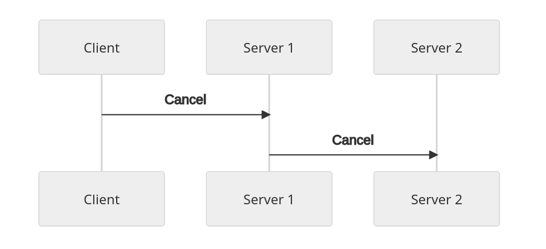

# Introduction to gRPC
- It is a protocol that uses protobuf, to call a object from a GRPC Server, that by using protobuf enables the client to run it like it is a local object
- As another RPCS, it is based on defining a certain service using interfaces, mentioning the methods
- The server implements its interface and runs a GRPC server to handle the client calls
- On the client side, the client has a stub, that provides the same methods as the server

- Servers and clients can be writen in different programming languages
- gRPC uses [Protocol Buffers](Protocol-buffers/readme.md) by default, which is a different type of serialization of data such as JSON (we can still use json)

#  Quick Start
### Dependencies
- go
- protoc (protocol buffer compiler)
- go plugins
  ```
  go install google.golang.org/protobuf/cmd/protoc-gen-go@v1.28
  go install google.golang.org/grpc/cmd/protoc-gen-go-grpc@v1.2
  ```
### Run Hello world code [Link](quickstart/grpc-go/examples/helloworld/)
We made a edit to the proto file inside of examples/helloworld/helloworld and we run:
```
protoc --go_out=. --go_opt=paths=source_relative \
    --go-grpc_out=. --go-grpc_opt=paths=source_relative \
    helloworld/helloworld.proto
```
Run both programs once again

# Core concepts, architecture and lifecycle
- It lets you define four types of services
  ```
    (Unary RPCS) Single request and receive single response back   
        -> rpc SayHello(HelloRequest) returns (HelloResponse);
    
    (Server streaming RPCs) Client sends a request to the server and gets a stream to read a sequence of messages back. Client reads from the returned stream until there are no more messages. gRPC guarantees message ordering within an individual RPC call. gRPC garantees message ordering within an individual RPC call.
        -> rpc LotsOfReplies(HelloRequest) returns (stream HelloResponse);
    
    (Client streaming RPCs) Client writes a stream of messages and sends them to the server. Client waits until the server reads all the messages

    (Bidirectional Streaming RPCs) Streaming in both sides, the response can be sended from both sides whenever they intend to
  ```
## Using the api
- .proto file generate both client and server side code, the apis are called in the client side and then implemented in the server side
- Server side, the server implements the methods declared by the service and runs a gRPC server to handle the client calls. The gRPC infrastructure decodes incoming requests, execute services methods and encode service responses
- Client, has a local object known as stub that implements the same methods as the service. The client can then just call those methods on the local object. After that, all the parameters get stored in the correct buffer message type, after that it sends it to the server and the server answer the request back

## Synchronous vs Asynchronous
- Synchronous RPC calls can block until the response get received. On the other hand beeing Async or Sync may depend of the use case and the go language may offer this operations out of the box   

## RPC Life Cycle
- The lifecycle is for types of RPCS that we mentioned before
### Unary RPC
1. - Client calls the stub method
   - Server is notified about the invocation with the clients metadata for this call, the method name and the deadline if disposed
----
2. - Server either send back its own initial metadata or wait a client request message, what happens first is app-specific
   - Metadata must be sent before any response 
----
3. - Once the server has the client request message it does whatever is necessary to populate the request with a response
   - The response is returned if sucessfull (together with status detail and optional trailling data)
---- 
4. - If status is OK, the client gets the response, which completes the call on the client Side
### Server Streamming RPC
- This one is almost the same but the difference is that the server sends all the messages and only on the final sends the server status details
### Client Streaming RPC
- Simmilar to the unary RPC, but the difference is that the client sends all the messages and gets one response back from the server with the server details
### Bidirectional Streaming RPC
- The client initiates the communications, invoking the methods and the server receiving the client metadata, method name and deadline. 
- The server can choose to send back its initial metadata or wait for the client to start streamming messages
- After all of that the proccess is app-specific, the 2 streams are independent
- Both can read and write messages in any order
- It works as a ping pong, or the server can wait the receival of messages, it is app-specific
### Deadlines/Timeout
- Clients can specify how much time they are willing to wait for an RPC to complete, before the RPC gets terminated with a DEADLINE_EXCEED error
### RPC Termination
- The conclusions of the call may not match between the two components (ex: The server may think the call went sucessfully, but on the client side it can have another kind of conclusion)
### Cancelling an RPC
- Both the server and the client can cancel an RPC at any time
- There are no rollbacks, what is done, is done
### Metadata
- It is information about a particular RPC call (such as authentication details)
- It is in a list of key-value pairs, there keys are Strings and values are typically strings, but can be also binary
- Keys are case insensitive and consist of ASCII letters, digits and special chars "-","_","."
- It cannot start with grpc-
- Binary valued keys end in "-bin", ASCII-valued keys do not
- Access to metadata is language dependent
- We can add custom key value pairs, which makes gRPC very flexible
### Channels
- gRPC channels are used to provide a connection in a specific host and port
- It is used when creating a client stub
- Clients can specify arguments to modify the behavior of the channel
- Channel has state, including connected and idle
# Basics Tutorial
- This example is a simple route mapping app
- Lets the clients know features on their route
- Create Summary of their route
- Exchange information such as traffic updates with the server and other clients
- Grpc becomes very usefull because it creates all the client and server and handles the communication himself. Also it has efficient serialization because of the buffers protocol, simple IDL and easy interface upgrating
## Notes about the tutorial
- The tutorial is here [Link](./basics-tutorial/)
- We defined the services and one message
- To generate the files we need to use this command:
  ```
    protoc --go_out=paths=source_relative:. --go-grpc_out=paths=source_relative:. route_guide.proto
  ```
- Note that we are saying that we want to generate it on the same directory we are. Also, we need to be on that exac directory as well because of the package that the generated files will retain
- After running this command it will generate two files: route_guide.pb.go, which stands for a protocol buffer to populate, serialize and retrieve request and response message types. route_guide_grpc.pb.go, which stands for a interface type (or stub) for clients to call with the methods defined in the RouteGuide service and a given interface type for servers to implement, also with the methods defined in the RouteGuide Service
- We will firstly implement the server using this interface
# ALTS authentication
- This the gRPC authentication 
- It stands for application Layer Transport Security (ALTS)
- It is a mutual authentication and transport authentication developed by Google.
- It was designed to meet the google requirements
## Features
- Create gRPC server & clients with ALTS as the transport security protocol
- ALTS connections are end-to-end protected with privacy and integrity
- Applications can access peer info such as the peer service account
- Client authorization and server auth support
- Minimal code changes to enable ALTS
- Can be used on clouds, it can be applied in any platform with ALTS handshaker service
## gRPC Client with ALTS Transport Security Protocol
- Example of how to use it 
  ```
    import (
    "google.golang.org/grpc"
    "google.golang.org/grpc/credentials/alts"
  )

  altsTC := alts.NewClientCreds(alts.DefaultClientOptions())
  conn, err := grpc.Dial(serverAddr, grpc.WithTransportCredentials(altsTC))
  ```
## gRPC Server with ALTS Transport Security Protocol
- Example
  ```
  import (
  "google.golang.org/grpc"
  "google.golang.org/grpc/credentials/alts"
  )

  altsTC := alts.NewServerCreds(alts.DefaultServerOptions())
  server := grpc.NewServer(grpc.Creds(altsTC))
  ```
## Server Authorization
- gRPC has built-in server authorization supp using ALTS
- Before the connection a given client can specify a list of expected server service accounts
- Server service accounts are identities, they normally are represented by unique email addresses
- The server guarantees that one of the identities provided by the client match one of the identities the server itself posesses
- Case the authentication fails, the connection also fails
- Example:
  ```
  import (
  "google.golang.org/grpc"
  "google.golang.org/grpc/credentials/alts"
  )

  clientOpts := alts.DefaultClientOptions()
  // HERE WE SHOULD SPECIFY THE ACCOUNTS
  clientOpts.TargetServiceAccounts = []string{expectedServerSA}
  altsTC := alts.NewClientCreds(clientOpts)
  conn, err := grpc.Dial(serverAddr, grpc.WithTransportCredentials(altsTC))
  ```
## Client Authorization
- On a successful connection, the peer info is stored in the AltsContext. Assuming it knows the email, it can give permission to authorize the incoming RPC.
  ```
  import (
  "google.golang.org/grpc"
  "google.golang.org/grpc/credentials/alts"
  )

  err := alts.ClientAuthorizationCheck(ctx, []string{"foo@iam.gserviceaccount.com"})
  ```
# Generated-code reference
- This is the description of the generated code with protoc
- client-side RPC and server-side RPC are thread-safe. They are meant to be run on concurrent goroutines.
- You cannot have multiple parallel read operations or multiple parallel write operations happening on the same stream
- Individual streams support concurrent reads and writes
- Same stream is serial, which means the order is maintained
# Methods on generated server interfaces
- On the server side, each Service, in the .proto file results in a function like this:
  ```
  func Register(name of the service)Server(s *grpc.Server, srv (name of the service)Server )
  ```
- The application can define a concrete impl of the BarServer interface and register it with grpc.Server instance (before starting the server instance)
## Unary methods (Server side normal request-response)
- The methods have the following signature on the generated service interface
  ```
  Foo(context.Context,*MsgA)(*MsgB,error)
  ```
- MsgA is the protobuf message sent from the client
- MsgB is the protobuf message sent back from the Server

## Server-streaming methods (Server side normal streaming from server to client)
- For the server-streaming methods we have something like this:
  ```
  Foo(*MsgA,<ServiceName>_FooServer) error
  ```
- "(ServiceName)_FooServer" can be used to represent server-to-client stream of MsgB messages
- The following interface is has follows:
  ```
  type <ServiceName>_FooServer interface{
    Send(*MsgB) error
    grpc.ServerStream
  }
  ```
- Server side uses this method from the interface "Send" to send the messages
- When the method returns something, the stream ends
## Client-streaming methods (Server side normal receival of the stream by the client)
- For the client streaming we have something alike, like this:
 ```
 Foo(<ServiceName>_FooServer) error
 ```
- This service can be used for both read the message stream and send single server response message
- The interface to send messages is like this:
  ```
  type <ServiceName>_FooServer interface {
	SendAndClose(*MsgA) error
	Recv() (*MsgB, error)
	grpc.ServerStream
  }
  ```
- Recv can be used to get the next message in the stack, after the stack get empty it returns a error of EOF
- Single message is SendAndClose
## Bidi-streaming methods (Server side bidi connection, there is no close, we can send simultaneously)
- These methods have the following signature on the generated service interface:
  ```
  Foo(<ServiceName>_FooServer) error
  ```
- It can be used to access both the client-server message and the server-to-client
- The interface itself is something like this:
  ```
  type <ServiceName>_FooServer interface {
	Send(*MsgA) error
	Recv() (*MsgB, error)
	grpc.ServerStream
  }
  ```
- Recv is the same us upward
- Response server-to-client message is sent by repeatedly caling the Send method
# Methods on generated client interfaces
- The methods here presented are relative to the client side
## Unary Methods (Client side, to make the request and also the return)
- The signature is something like this:
  ```
  (ctx context.Context, in *MsgA, opts ...grpc.CallOption) (*MsgB, error)
  ```
- *MsgA is the single request from client to server
- *MsgB is the response from the server
## Server-Streaming methods (client side receival of the stream)
- It has the following signature on the generated client stub:
  ```
  Foo(ctx context.Context, in *MsgA, opts ...grpc.CallOption) (<ServiceName>_FooClient, error)
  ```
- The interface is something like this
  ```
  type <ServiceName>_FooClient interface {
	Recv() (*MsgB, error)
	grpc.ClientStream
  }
  ```
## Client-Streaming methods (client side, send a stream)
- Signature
  ```
  Foo(ctx context.Context, opts ...grpc.CallOption) (<ServiceName>_FooClient, error)
  ```
- Interface
  ```
  type <ServiceName>_FooClient interface {
	Send(*MsgA) error
	CloseAndRecv() (*MsgB, error)
	grpc.ClientStream
  }
  ```
## Bidi-Streaming methods (client side, bidi connection)
- Signature
  ```
  Foo(ctx context.Context, opts ...grpc.CallOption) (<ServiceName>_FooClient, error)
  ```
- Interface
  ```
  type <ServiceName>_FooClient interface {
	Send(*MsgA) error
	Recv() (*MsgB, error)
	grpc.ClientStream
  }
  ```
# Cancellation
- Explanation of when should we cancel RPC's
## Overview
- It happens when a client is no longer interest in the result of a RPC call
- Deadline also triggers this cancelation
- When RPC is cancelled, the server should stop computation
- Servers can also be clients of other servers, ideally we should cancel every operation (like cascade)

## Cancelling an RPC Call on the Client Side
- Client cancells the RPC call using the method on the call object or on the context
- Client does not provide details about the cancelation
- The cancel normally provides a way to throw a client-side exception with the reason
- The server may be busy when receiving the cancelation
- The server must keep checking if the RPC that made the request keeps alive
- Some languages handle it for us, others don't
- Golang automatically cancels outgoing RPCs
