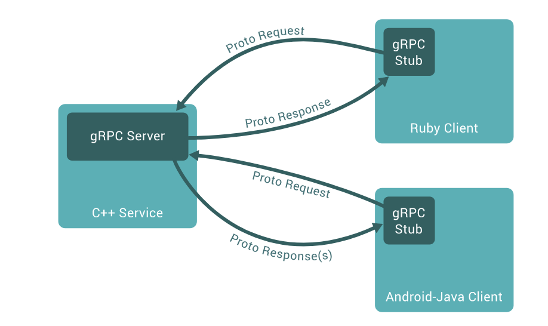

# Introduction to gRPC
- It is a protocol that uses protobuf, to call a object from a GRPC Server, that by using protobuf enables the client to run it like it is a local object
- As another RPCS, it is based on defining a certain service using interfaces, mentioning the methods
- The server implements its interface and runs a GRPC server to handle the client calls
- On the client side, the client has a stub, that provides the same methods as the server

- Servers and clients can be writen in different programming languages
- gRPC uses [Protocol Buffers](Protocol-buffers/readme.md) by default, which is a different type of serialization of data such as JSON (we can still use json)